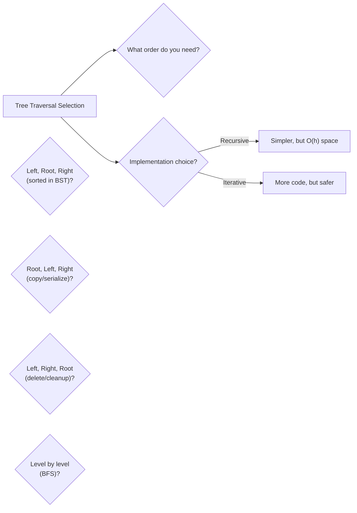

# Trees - Traversals

> Visit every node in a tree using Inorder, Preorder, Postorder, or Level-Order

---

## Learning Objectives

By the end of this section you should be able to:

- Name the four standard traversal orders and state the visit sequence each uses (Left-Root-Right, Root-Left-Right, Left-Right-Root, level by level)
- Explain why inorder traversal of a BST produces values in sorted order
- Implement both recursive and iterative versions of inorder traversal and state the key difference between the loop condition `curr != null` and the full condition `curr != null || !stack.isEmpty()`
- Describe what Morris traversal achieves, what thread it temporarily creates, and why it must remove that thread before moving on
- Choose the correct traversal for a given task: sorted extraction (inorder), tree copy or serialisation (preorder), safe deletion (postorder), shortest path or level-wise processing (level-order)
- Diagnose common traversal bugs: wrong loop condition in iterative inorder, processing all nodes in one pass in level-order, and using a stack instead of a queue for BFS

---

## ELI5: Explain Like I'm 5

<div class="learner-section" markdown>

**Your task:** After implementing all patterns, explain them simply.

**Prompts to guide you:**

1. **What are tree traversals in one sentence?**
    - Your answer: <span class="fill-in">[Tree traversals are systematic ways to visit every node in a tree exactly once, where the only difference between them is ___ — the order in which you visit the root relative to its left and right subtrees]</span>

2. **Why do we need different traversal orders?**
    - Your answer: <span class="fill-in">[Different orders expose different relationships: inorder gives ___ for a BST, preorder gives the root before its children which is useful for ___, and postorder processes children before the parent which is required when ___]</span>

3. **Real-world analogy:**
    - Example: "Tree traversals are like different ways to read a family tree..."
    - Your analogy: <span class="fill-in">[Fill in]</span>

4. **When does each traversal order matter?**
    - Your answer: <span class="fill-in">[Fill in after solving problems]</span>

5. **What's the difference between iterative and recursive?**
    - Your answer: <span class="fill-in">[Recursive traversal uses the call stack implicitly, so it has O(h) space from recursion frames; iterative traversal uses an explicit ___ data structure and avoids ___ overflow risk for very deep trees, though both have the same O(h) worst-case space]</span>

</div>

---

## Quick Quiz (Do BEFORE implementing)

!!! tip "How to use this section"
    Write your best guess in each fill-in span **before** reading any implementation code. Your predictions do not need to be correct — the act of committing to an answer first makes the correct answer stick much better when you verify it later.

<div class="learner-section" markdown>

**Your task:** Test your intuition without looking at code. Answer these, then verify after implementation.

### Complexity Predictions

1. **Visiting every node in a tree:**
    - Time complexity: <span class="fill-in">[Your guess: O(?)]</span>
    - Verified after learning: <span class="fill-in">[Actual: O(?)]</span>

2. **Recursive inorder traversal:**
    - Time complexity: <span class="fill-in">[Your guess: O(?)]</span>
    - Space complexity: <span class="fill-in">[Your guess: O(?)]</span>
    - Verified: <span class="fill-in">[Actual]</span>

3. **Iterative vs Recursive space:**
    - Recursive space usage: <span class="fill-in">[O(?) - what uses the space?]</span>
    - Iterative space usage: <span class="fill-in">[O(?) - what data structure?]</span>
    - Morris traversal space: <span class="fill-in">[O(?)]</span>

### Scenario Predictions

**Scenario 1:** Traverse this BST and predict output for each traversal

```
Tree:     4
         / \
        2   6
       / \
      1   3
```

- **Inorder (Left, Root, Right):** <span class="fill-in">[Predict: ?, ?, ?, ?, ?]</span>
- **Preorder (Root, Left, Right):** <span class="fill-in">[Predict: ?, ?, ?, ?, ?]</span>
- **Postorder (Left, Right, Root):** <span class="fill-in">[Predict: ?, ?, ?, ?, ?]</span>
- **Level-order (BFS):** _[Predict: [[?], [?, ?], [?, ?]]]_

**Verify after implementation:** Were your predictions correct? <span class="fill-in">[Yes/No]</span>

**Scenario 2:** Why does inorder give sorted output for BST?

- Your answer: <span class="fill-in">[Fill in before implementation]</span>
- Verified answer: <span class="fill-in">[Fill in after learning]</span>

**Scenario 3:** Which traversal to use for deleting a tree?

- Your guess: <span class="fill-in">[Inorder/Preorder/Postorder/Level-order - Why?]</span>
- Reasoning: <span class="fill-in">[Fill in your logic]</span>
- Verified: <span class="fill-in">[After implementation]</span>

### Trade-off Quiz

**Question:** When would iterative traversal be BETTER than recursive?

- Your answer: <span class="fill-in">[Fill in before implementation]</span>
- Verified answer: <span class="fill-in">[Fill in after learning]</span>

**Question:** What's the MAIN advantage of Morris traversal?

- [ ] Faster than recursive
- [ ] O(1) space complexity
- [ ] Easier to implement
- [ ] Works for all tree types

Verify after implementation: <span class="fill-in">[Which one(s)?]</span>

**Question:** Which traversal order matters for expression trees?

- Infix notation uses: <span class="fill-in">[Which traversal?]</span>
- Prefix notation uses: <span class="fill-in">[Which traversal?]</span>
- Postfix notation uses: <span class="fill-in">[Which traversal?]</span>

</div>

---

## Core Implementation

### Pattern 1: Inorder Traversal (Left, Root, Right)

**Concept:** Visit left subtree, then root, then right subtree.

**Use case:** Get sorted order from BST, expression evaluation.

```java
import java.util.*;

public class InorderTraversal {

    static class TreeNode {
        int val;
        TreeNode left, right;

        TreeNode(int val) {
            this.val = val;
        }
    }

    /**
     * Problem: Inorder traversal recursively
     * Time: O(n), Space: O(h) where h = height for recursion stack
     *
     * TODO: Implement recursive inorder
     */
    public static List<Integer> inorderRecursive(TreeNode root) {
        List<Integer> result = new ArrayList<>();

        // TODO: Handle base case

        // TODO: Recursively traverse left subtree
        // TODO: Visit root (add to result)
        // TODO: Recursively traverse right subtree

        return result; // Replace with implementation
    }

    /**
     * Problem: Inorder traversal iteratively using stack
     * Time: O(n), Space: O(h)
     *
     * TODO: Implement iterative inorder
     */
    public static List<Integer> inorderIterative(TreeNode root) {
        List<Integer> result = new ArrayList<>();
        // TODO: Create Stack<TreeNode>

        // TODO: curr = root
        // TODO: Implement iteration/conditional logic

        return result; // Replace with implementation
    }

    /**
     * Problem: Inorder traversal with Morris (no extra space)
     * Time: O(n), Space: O(1)
     *
     * TODO: Implement Morris traversal
     */
    public static List<Integer> inorderMorris(TreeNode root) {
        List<Integer> result = new ArrayList<>();

        // TODO: curr = root
        // TODO: Implement iteration/conditional logic

        return result; // Replace with implementation
    }
}
```

!!! warning "Debugging Challenge — Wrong Loop Condition in Iterative Inorder"
    ```java
    /**
     * Iterative inorder with stack.
     * This has 2 CRITICAL BUGS with stack logic.
     */
    public static List<Integer> inorderIterative_Buggy(TreeNode root) {
        List<Integer> result = new ArrayList<>();
        Stack<TreeNode> stack = new Stack<>();
        TreeNode curr = root;

        while (!stack.isEmpty()) {        while (curr != null) {
                stack.push(curr);
                curr = curr.left;
            }

            TreeNode node = stack.pop();
            result.add(node.val);
            curr = curr.left;    }

        return result;
    }
    ```

    - **Bug 1:** <span class="fill-in">[What's wrong with the outer while condition?]</span>
    - **Bug 2:** <span class="fill-in">[Which direction should curr move after visiting a node?]</span>

??? success "Answer"
    **Bug 1:** The outer condition `while (!stack.isEmpty())` is wrong. At the very start the stack is empty, so the loop
    never executes even when root is non-null. The correct condition is `while (curr != null || !stack.isEmpty())`.
    This keeps the loop alive as long as either there are nodes yet to push (curr != null) or nodes already pushed that
    have not been visited yet (!stack.isEmpty()).

    **Bug 2:** After popping and visiting a node, `curr` should be set to `node.right`, not `curr.left`. After visiting a
    node we need to explore its **right** subtree. Using `curr.left` causes an infinite loop or NullPointerException.

    **Correct code:**
    ```java
    while (curr != null || !stack.isEmpty()) {
        while (curr != null) {
            stack.push(curr);
            curr = curr.left;
        }
        TreeNode node = stack.pop();
        result.add(node.val);
        curr = node.right;  // Go right after visiting
    }
    ```

**Runnable Client Code:**

```java
import java.util.*;

public class InorderTraversalClient {

    public static void main(String[] args) {
        System.out.println("=== Inorder Traversal ===\n");

        // Create tree:
        //       4
        //      / \
        //     2   6
        //    / \ / \
        //   1  3 5  7
        TreeNode root = new TreeNode(4);
        root.left = new TreeNode(2);
        root.right = new TreeNode(6);
        root.left.left = new TreeNode(1);
        root.left.right = new TreeNode(3);
        root.right.left = new TreeNode(5);
        root.right.right = new TreeNode(7);

        System.out.println("Tree structure:");
        System.out.println("       4");
        System.out.println("      / \\");
        System.out.println("     2   6");
        System.out.println("    / \\ / \\");
        System.out.println("   1  3 5  7");
        System.out.println();

        // Test 1: Recursive inorder
        System.out.println("--- Test 1: Recursive Inorder ---");
        List<Integer> recursive = InorderTraversal.inorderRecursive(root);
        System.out.println("Result: " + recursive);
        System.out.println("(Should be: [1, 2, 3, 4, 5, 6, 7])");

        // Test 2: Iterative inorder
        System.out.println("\n--- Test 2: Iterative Inorder ---");
        List<Integer> iterative = InorderTraversal.inorderIterative(root);
        System.out.println("Result: " + iterative);

        // Test 3: Morris inorder
        System.out.println("\n--- Test 3: Morris Inorder (O(1) space) ---");
        List<Integer> morris = InorderTraversal.inorderMorris(root);
        System.out.println("Result: " + morris);
    }
}
```

---

### Pattern 2: Preorder Traversal (Root, Left, Right)

**Concept:** Visit root first, then left subtree, then right subtree.

**Use case:** Create copy of tree, prefix expression, serialize tree.

```java
import java.util.*;

public class PreorderTraversal {

    static class TreeNode {
        int val;
        TreeNode left, right;

        TreeNode(int val) {
            this.val = val;
        }
    }

    /**
     * Problem: Preorder traversal recursively
     * Time: O(n), Space: O(h)
     *
     * TODO: Implement recursive preorder
     */
    public static List<Integer> preorderRecursive(TreeNode root) {
        List<Integer> result = new ArrayList<>();

        // TODO: Handle base case

        // TODO: Visit root (add to result)
        // TODO: Recursively traverse left subtree
        // TODO: Recursively traverse right subtree

        return result; // Replace with implementation
    }

    /**
     * Problem: Preorder traversal iteratively using stack
     * Time: O(n), Space: O(h)
     *
     * TODO: Implement iterative preorder
     */
    public static List<Integer> preorderIterative(TreeNode root) {
        List<Integer> result = new ArrayList<>();

        // TODO: Implement iteration/conditional logic
        // TODO: Create Stack<TreeNode>, push root

        // TODO: Implement iteration/conditional logic

        return result; // Replace with implementation
    }
}
```

**Runnable Client Code:**

```java
import java.util.*;

public class PreorderTraversalClient {

    public static void main(String[] args) {
        System.out.println("=== Preorder Traversal ===\n");

        // Create tree:
        //       4
        //      / \
        //     2   6
        //    / \ / \
        //   1  3 5  7
        TreeNode root = new TreeNode(4);
        root.left = new TreeNode(2);
        root.right = new TreeNode(6);
        root.left.left = new TreeNode(1);
        root.left.right = new TreeNode(3);
        root.right.left = new TreeNode(5);
        root.right.right = new TreeNode(7);

        System.out.println("Tree structure:");
        System.out.println("       4");
        System.out.println("      / \\");
        System.out.println("     2   6");
        System.out.println("    / \\ / \\");
        System.out.println("   1  3 5  7");
        System.out.println();

        // Test 1: Recursive preorder
        System.out.println("--- Test 1: Recursive Preorder ---");
        List<Integer> recursive = PreorderTraversal.preorderRecursive(root);
        System.out.println("Result: " + recursive);
        System.out.println("(Should be: [4, 2, 1, 3, 6, 5, 7])");

        // Test 2: Iterative preorder
        System.out.println("\n--- Test 2: Iterative Preorder ---");
        List<Integer> iterative = PreorderTraversal.preorderIterative(root);
        System.out.println("Result: " + iterative);
    }
}
```

---

### Pattern 3: Postorder Traversal (Left, Right, Root)

**Concept:** Visit left subtree, then right subtree, then root.

**Use case:** Delete tree, calculate directory size, postfix expression.

```java
import java.util.*;

public class PostorderTraversal {

    static class TreeNode {
        int val;
        TreeNode left, right;

        TreeNode(int val) {
            this.val = val;
        }
    }

    /**
     * Problem: Postorder traversal recursively
     * Time: O(n), Space: O(h)
     *
     * TODO: Implement recursive postorder
     */
    public static List<Integer> postorderRecursive(TreeNode root) {
        List<Integer> result = new ArrayList<>();

        // TODO: Handle base case

        // TODO: Recursively traverse left subtree
        // TODO: Recursively traverse right subtree
        // TODO: Visit root (add to result)

        return result; // Replace with implementation
    }

    /**
     * Problem: Postorder traversal iteratively using two stacks
     * Time: O(n), Space: O(h)
     *
     * TODO: Implement iterative postorder
     */
    public static List<Integer> postorderIterative(TreeNode root) {
        List<Integer> result = new ArrayList<>();

        // TODO: Implement iteration/conditional logic
        // TODO: Create two stacks: stack1 and stack2
        // TODO: Push root to stack1

        // TODO: Implement iteration/conditional logic

        // TODO: Pop all from stack2 to result

        return result; // Replace with implementation
    }
}
```

**Runnable Client Code:**

```java
import java.util.*;

public class PostorderTraversalClient {

    public static void main(String[] args) {
        System.out.println("=== Postorder Traversal ===\n");

        // Create tree:
        //       4
        //      / \
        //     2   6
        //    / \ / \
        //   1  3 5  7
        TreeNode root = new TreeNode(4);
        root.left = new TreeNode(2);
        root.right = new TreeNode(6);
        root.left.left = new TreeNode(1);
        root.left.right = new TreeNode(3);
        root.right.left = new TreeNode(5);
        root.right.right = new TreeNode(7);

        System.out.println("Tree structure:");
        System.out.println("       4");
        System.out.println("      / \\");
        System.out.println("     2   6");
        System.out.println("    / \\ / \\");
        System.out.println("   1  3 5  7");
        System.out.println();

        // Test 1: Recursive postorder
        System.out.println("--- Test 1: Recursive Postorder ---");
        List<Integer> recursive = PostorderTraversal.postorderRecursive(root);
        System.out.println("Result: " + recursive);
        System.out.println("(Should be: [1, 3, 2, 5, 7, 6, 4])");

        // Test 2: Iterative postorder
        System.out.println("\n--- Test 2: Iterative Postorder ---");
        List<Integer> iterative = PostorderTraversal.postorderIterative(root);
        System.out.println("Result: " + iterative);
    }
}
```

---

### Pattern 4: Level-Order Traversal (BFS)

**Concept:** Visit nodes level by level, left to right.

**Use case:** Find shortest path, serialize by level, level-wise processing.

```java
import java.util.*;

public class LevelOrderTraversal {

    static class TreeNode {
        int val;
        TreeNode left, right;

        TreeNode(int val) {
            this.val = val;
        }
    }

    /**
     * Problem: Level-order traversal using queue
     * Time: O(n), Space: O(w) where w = max width
     *
     * TODO: Implement BFS using queue
     */
    public static List<List<Integer>> levelOrder(TreeNode root) {
        List<List<Integer>> result = new ArrayList<>();

        // TODO: Implement iteration/conditional logic
        // TODO: Create Queue<TreeNode>, add root

        // TODO: Implement iteration/conditional logic

        return result; // Replace with implementation
    }

    /**
     * Problem: Level-order traversal in zigzag pattern
     * Time: O(n), Space: O(w)
     *
     * TODO: Implement zigzag traversal
     */
    public static List<List<Integer>> zigzagLevelOrder(TreeNode root) {
        List<List<Integer>> result = new ArrayList<>();

        // TODO: Similar to levelOrder but alternate direction
        // TODO: Use boolean flag to track left-to-right vs right-to-left
        // TODO: Reverse level list when going right-to-left

        return result; // Replace with implementation
    }

    /**
     * Problem: Right side view of tree
     * Time: O(n), Space: O(w)
     *
     * TODO: Implement right side view
     */
    public static List<Integer> rightSideView(TreeNode root) {
        List<Integer> result = new ArrayList<>();

        // TODO: Use level-order traversal
        // TODO: Add last node of each level to result

        return result; // Replace with implementation
    }
}
```

**Runnable Client Code:**

```java
import java.util.*;

public class LevelOrderTraversalClient {

    public static void main(String[] args) {
        System.out.println("=== Level-Order Traversal ===\n");

        // Create tree:
        //       4
        //      / \
        //     2   6
        //    / \ / \
        //   1  3 5  7
        TreeNode root = new TreeNode(4);
        root.left = new TreeNode(2);
        root.right = new TreeNode(6);
        root.left.left = new TreeNode(1);
        root.left.right = new TreeNode(3);
        root.right.left = new TreeNode(5);
        root.right.right = new TreeNode(7);

        System.out.println("Tree structure:");
        System.out.println("       4");
        System.out.println("      / \\");
        System.out.println("     2   6");
        System.out.println("    / \\ / \\");
        System.out.println("   1  3 5  7");
        System.out.println();

        // Test 1: Level-order
        System.out.println("--- Test 1: Level-Order Traversal ---");
        List<List<Integer>> levels = LevelOrderTraversal.levelOrder(root);
        System.out.println("Result: " + levels);
        System.out.println("(Should be: [[4], [2, 6], [1, 3, 5, 7]])");

        // Test 2: Zigzag level-order
        System.out.println("\n--- Test 2: Zigzag Level-Order ---");
        List<List<Integer>> zigzag = LevelOrderTraversal.zigzagLevelOrder(root);
        System.out.println("Result: " + zigzag);
        System.out.println("(Should be: [[4], [6, 2], [1, 3, 5, 7]])");

        // Test 3: Right side view
        System.out.println("\n--- Test 3: Right Side View ---");
        List<Integer> rightView = LevelOrderTraversal.rightSideView(root);
        System.out.println("Result: " + rightView);
        System.out.println("(Should be: [4, 6, 7])");
    }
}
```

---

!!! info "Loop back"
    Now that you have implemented all four patterns, return to the **ELI5** section and fill in the scaffolded prompts. In particular, lock in prompt 2 (why different orders matter) and prompt 5 (iterative vs recursive trade-off). Then return to the **Quick Quiz** and verify whether your level-order space prediction was O(w) or O(n). For a complete binary tree the last level holds n/2 nodes, so the queue can hold up to n/2 nodes simultaneously — confirm you understand why that still counts as O(n) space in the worst case.

---

## Before/After: Why This Pattern Matters

**Your task:** Compare naive vs optimized approaches to understand the impact.

### Example: Collecting Tree Values

**Problem:** Get all values from a tree in sorted order (BST).

#### Approach 1: Collect All, Then Sort

```java
// Naive approach - Collect values in any order, then sort
public static List<Integer> getTreeValues_BruteForce(TreeNode root) {
    List<Integer> result = new ArrayList<>();

    // Collect values using preorder (any order)
    collectValues(root, result);

    // Sort the collected values
    Collections.sort(result);

    return result;
}

private static void collectValues(TreeNode node, List<Integer> result) {
    if (node == null) return;
    result.add(node.val);
    collectValues(node.left, result);
    collectValues(node.right, result);
}
```

**Analysis:**

- Time: O(n log n) - O(n) to collect + O(n log n) to sort
- Space: O(n) for list + O(log n) for recursion stack
- For n = 10,000: ~140,000 operations

#### Approach 2: Inorder Traversal (Optimized)

```java
// Optimized approach - Use inorder traversal for BST
public static List<Integer> getTreeValues_Inorder(TreeNode root) {
    List<Integer> result = new ArrayList<>();

    inorderHelper(root, result);

    return result; // Already sorted!
}

private static void inorderHelper(TreeNode node, List<Integer> result) {
    if (node == null) return;

    inorderHelper(node.left, result);   // Visit left subtree
    result.add(node.val);                // Visit root
    inorderHelper(node.right, result);   // Visit right subtree
}
```

**Analysis:**

- Time: O(n) - Visit each node exactly once
- Space: O(n) for list + O(h) for recursion stack (h = height)
- For n = 10,000: ~10,000 operations

#### Performance Comparison

| Tree Size  | Collect + Sort (O(n log n)) | Inorder (O(n)) | Speedup |
|------------|-----------------------------|----------------|---------|
| n = 100    | ~664 ops                    | 100 ops        | 6.6x    |
| n = 1,000  | ~9,966 ops                  | 1,000 ops      | 10x     |
| n = 10,000 | ~132,877 ops                | 10,000 ops     | 13x     |

**Your calculation:** For n = 5,000, the speedup is approximately _____ times faster.

#### Recursive vs Iterative: Stack Space

**Problem:** Inorder traversal of a deeply nested tree.

**Approach 1: Recursive**

```java
public static void inorderRecursive(TreeNode root) {
    if (root == null) return;

    inorderRecursive(root.left);
    System.out.print(root.val + " ");
    inorderRecursive(root.right);
}
```

**Analysis:**

- Space: O(h) where h = tree height
- For balanced tree: h = log n (good!)
- For skewed tree: h = n (danger of stack overflow!)
- Example: Tree with 100,000 nodes in a line = 100,000 recursive calls

**Approach 2: Iterative with Explicit Stack**

```java
public static void inorderIterative(TreeNode root) {
    Stack<TreeNode> stack = new Stack<>();
    TreeNode curr = root;

    while (curr != null || !stack.isEmpty()) {
        while (curr != null) {
            stack.push(curr);
            curr = curr.left;
        }
        curr = stack.pop();
        System.out.print(curr.val + " ");
        curr = curr.right;
    }
}
```

**Analysis:**

- Space: O(h) - same as recursive, but explicit stack
- No stack overflow risk - heap memory is larger
- More control over the process
- Production-safe for deep trees

!!! note "Why the iterative version is safer for production"
    The JVM's call stack is typically limited to a few thousand frames (configurable but small). A skewed tree with 100,000 nodes will overflow that stack recursively but NOT with the iterative version — because the `Stack<TreeNode>` on the heap can grow as large as available memory. Both approaches are O(h) in theory, but in practice the iterative version handles the worst case far more reliably.

#### Why Does Traversal Order Matter?

**Key insight to understand:**

For this tree:

```
       4
      / \
     2   6
    / \
   1   3
```

**Inorder (Left, Root, Right):** 1, 2, 3, 4, 6

- Visits left child before parent
- **Use case:** Get sorted values from BST

**Preorder (Root, Left, Right):** 4, 2, 1, 3, 6

- Visits parent before children
- **Use case:** Copy tree structure, serialize tree

**Postorder (Left, Right, Root):** 1, 3, 2, 6, 4

- Visits children before parent
- **Use case:** Delete tree (delete children first!)

**Level-order (BFS):** [[4], [2, 6], [1, 3]]

- Visits level by level
- **Use case:** Find shortest path, level-wise processing

**After implementing, explain in your own words:**

<div class="learner-section" markdown>

- Why does postorder make sense for tree deletion? <span class="fill-in">[Your answer]</span>
- Why does preorder make sense for copying a tree? <span class="fill-in">[Your answer]</span>
- When would level-order be preferred over depth-first? <span class="fill-in">[Your answer]</span>

</div>

---

## Common Misconceptions

!!! warning "Misconception 1: Stack (LIFO) and Queue (FIFO) give the same traversal order"
    Using a stack gives DFS (depth-first), which processes the deepest nodes first. Using a queue gives BFS (breadth-first),
    which processes the shallowest nodes first. They are fundamentally different traversals. A common mistake is writing
    `Stack<TreeNode>` when the problem asks for level-order — the code compiles and produces *some* output, but it is
    DFS preorder, not level-order. Always use a `Queue` for level-order traversal.

!!! warning "Misconception 2: The inner loop in level-order should run until the queue is empty"
    Level-order groups nodes by level. The inner loop must process exactly the nodes that belong to the **current** level,
    not all nodes currently in the queue. The correct pattern is to capture `int levelSize = queue.size()` before the
    inner loop and iterate exactly `levelSize` times. Running until `queue.isEmpty()` collapses all levels into one list.

!!! warning "Misconception 3: Inorder of any binary tree gives sorted output"
    Inorder traversal gives sorted output **only for a Binary Search Tree (BST)** — a tree where every node's left
    subtree contains only smaller values and right subtree contains only larger values. For a general binary tree with
    arbitrary values, inorder traversal just visits nodes in Left-Root-Right order with no guarantee of sorted output.
    Always confirm the tree is a BST before relying on inorder for sorted results.

---

## Decision Framework

**Your task:** Build decision trees for tree traversal selection.

### Question 1: Which traversal order do you need?

Answer after solving problems:

- **Need sorted order from BST?** <span class="fill-in">[Use inorder]</span>
- **Need to copy tree structure?** <span class="fill-in">[Use preorder]</span>
- **Need to delete tree safely?** <span class="fill-in">[Use postorder]</span>
- **Need level-by-level processing?** <span class="fill-in">[Use level-order]</span>

### Question 2: Recursive vs Iterative?

**Recursive approach:**

- Pros: <span class="fill-in">[Simpler code, cleaner logic]</span>
- Cons: <span class="fill-in">[O(h) stack space, risk of stack overflow]</span>
- Use when: <span class="fill-in">[Tree depth is reasonable]</span>

**Iterative approach:**

- Pros: <span class="fill-in">[Explicit control, no stack overflow]</span>
- Cons: <span class="fill-in">[More complex code, need explicit stack/queue]</span>
- Use when: <span class="fill-in">[Deep trees, production code]</span>

### Your Decision Tree



---

## Practice

### LeetCode Problems

**Easy (Complete all 4):**

- [ ] [94. Binary Tree Inorder Traversal](https://leetcode.com/problems/binary-tree-inorder-traversal/)
    - Pattern: <span class="fill-in">[Inorder - recursive/iterative/Morris]</span>
    - Your solution time: <span class="fill-in">___</span>
    - Key insight: <span class="fill-in">[Fill in after solving]</span>

- [ ] [144. Binary Tree Preorder Traversal](https://leetcode.com/problems/binary-tree-preorder-traversal/)
    - Pattern: <span class="fill-in">[Preorder]</span>
    - Your solution time: <span class="fill-in">___</span>
    - Key insight: <span class="fill-in">[Fill in]</span>

- [ ] [145. Binary Tree Postorder Traversal](https://leetcode.com/problems/binary-tree-postorder-traversal/)
    - Pattern: <span class="fill-in">[Postorder]</span>
    - Your solution time: <span class="fill-in">___</span>
    - Key insight: <span class="fill-in">[Fill in]</span>

- [ ] [102. Binary Tree Level Order Traversal](https://leetcode.com/problems/binary-tree-level-order-traversal/)
    - Pattern: <span class="fill-in">[Level-order BFS]</span>
    - Your solution time: <span class="fill-in">___</span>
    - Key insight: <span class="fill-in">[Fill in]</span>

**Medium (Complete 3-4):**

- [ ] [103. Binary Tree Zigzag Level Order Traversal](https://leetcode.com/problems/binary-tree-zigzag-level-order-traversal/)
    - Pattern: <span class="fill-in">[Level-order with direction alternation]</span>
    - Difficulty: <span class="fill-in">[Rate 1-10]</span>
    - Key insight: <span class="fill-in">[Fill in]</span>

- [ ] [199. Binary Tree Right Side View](https://leetcode.com/problems/binary-tree-right-side-view/)
    - Pattern: <span class="fill-in">[Level-order, track rightmost]</span>
    - Difficulty: <span class="fill-in">[Rate 1-10]</span>
    - Key insight: <span class="fill-in">[Fill in]</span>

- [ ] [107. Binary Tree Level Order Traversal II](https://leetcode.com/problems/binary-tree-level-order-traversal-ii/)
    - Pattern: <span class="fill-in">[Level-order bottom-up]</span>
    - Difficulty: <span class="fill-in">[Rate 1-10]</span>
    - Key insight: <span class="fill-in">[Fill in]</span>

- [ ] [230. Kth Smallest Element in a BST](https://leetcode.com/problems/kth-smallest-element-in-a-bst/)
    - Pattern: <span class="fill-in">[Inorder with counter]</span>
    - Difficulty: <span class="fill-in">[Rate 1-10]</span>
    - Key insight: <span class="fill-in">[Fill in]</span>

**Hard (Optional):**

- [ ] [297. Serialize and Deserialize Binary Tree](https://leetcode.com/problems/serialize-and-deserialize-binary-tree/)
    - Pattern: <span class="fill-in">[Preorder or level-order]</span>
    - Key insight: <span class="fill-in">[Fill in after solving]</span>

- [ ] [987. Vertical Order Traversal of a Binary Tree](https://leetcode.com/problems/vertical-order-traversal-of-a-binary-tree/)
    - Pattern: <span class="fill-in">[Custom traversal with coordinates]</span>
    - Key insight: <span class="fill-in">[Fill in after solving]</span>

---

## Test Your Understanding

1. The iterative inorder traversal uses the condition `while (curr != null || !stack.isEmpty())`. Explain precisely what each part of this condition guards against. Then show what happens if you use only `while (!stack.isEmpty())` by tracing the execution on a two-node tree (root with only a left child).

2. Morris traversal achieves O(1) space by temporarily modifying the tree. Describe the thread it creates, when it removes it, and why failing to remove the thread causes an infinite loop. Then explain why Morris traversal is rarely used in production despite its space advantage.

3. The level-order implementation must capture `int levelSize = queue.size()` **before** the inner loop. Explain what goes wrong if you instead write `while (!queue.isEmpty())` as the inner loop condition. Trace the execution on a three-level tree to demonstrate.

4. A colleague claims "postorder is just inorder but reversed." Provide a concrete counter-example — a small tree where postorder and reverse-inorder produce different sequences — and explain why the claim is false.

5. You are asked to find the rightmost node at each level of a binary tree. Which traversal order do you use, and what is the key implementation detail that selects the rightmost node rather than just any node from that level? Now explain how you would adapt the same approach to find the **leftmost** node at each level.
