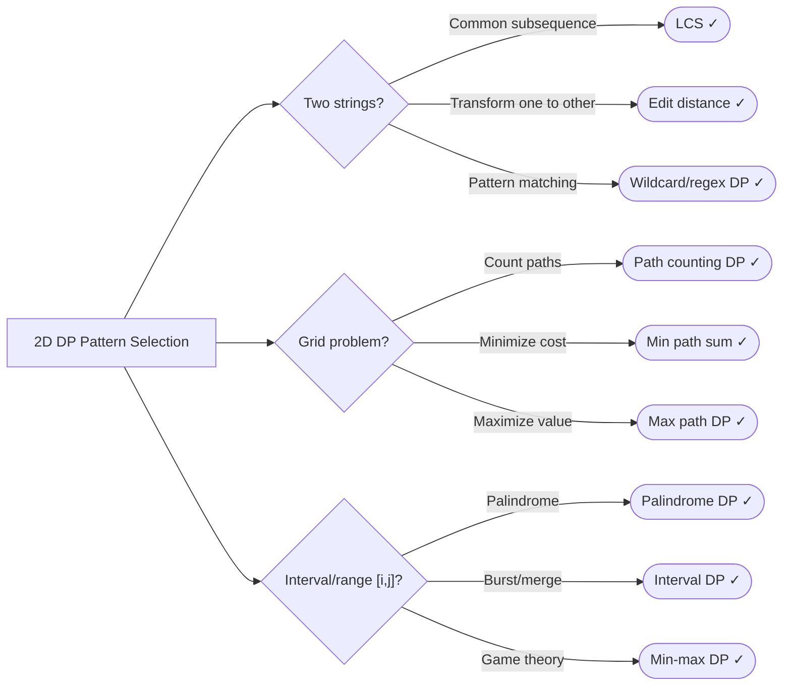

# Dynamic Programming (2D)

> Solve problems with two-dimensional state space using tabulation or memoization

---

## Learning Objectives

By the end of this topic you will be able to:

- Identify when a problem requires two-dimensional state (two strings, grid coordinates, item + capacity)
- Write correct recurrence relations for grid path, string matching, knapsack, and interval DP patterns
- Initialize 2D DP base cases correctly, including edge rows/columns and obstacle handling
- Distinguish DP table indices from string/array indices and avoid off-by-one errors
- Optimize a 2D DP table to 1D space when only one previous row is needed
- Recognize interval DP problems and implement the "last to burst" subproblem formulation

---

## ELI5: Explain Like I'm 5

<div class="learner-section" markdown>

**Your task:** After implementing all patterns, explain them simply.

**Prompts to guide you:**

1. **What is 2D DP in one sentence?**
    - 2D DP solves problems with two independent ___ by building a table where each cell stores the answer for a
      ___, computed from ___ cells already filled in.
    - Your answer: <span class="fill-in">[Fill in after implementation]</span>

2. **How is 2D DP different from 1D DP?**
    - 1D DP has ___ state variable, while 2D DP has ___ state variables representing ___ dimensions of the problem
      simultaneously.
    - Your answer: <span class="fill-in">[Fill in after implementation]</span>

3. **Real-world analogy:**
    - Example: "2D DP is like filling out a grid where each cell depends on cells above and to the left..."
    - Your analogy: <span class="fill-in">[Fill in]</span>

4. **When does this pattern work?**
    - This pattern works when the optimal solution for a problem of size (i, j) can be ___ from solutions to smaller
      problems, and those smaller problems ___.
    - Your answer: <span class="fill-in">[Fill in after solving problems]</span>

5. **How do you know when you need 2D instead of 1D?**
    - You need 2D when ___ dimensions are simultaneously important — for example, when comparing ___ strings
      character by character, or choosing items against a ___ constraint.
    - Your answer: <span class="fill-in">[Fill in after learning the pattern]</span>

</div>

---

## Quick Quiz (Do BEFORE implementing)

!!! tip "How to use this section"
    Complete your predictions now, before reading further. You will revisit and verify each answer after running the
    benchmark (or completing the implementation).

<div class="learner-section" markdown>

**Your task:** Test your intuition without looking at code. Answer these, then verify after implementation.

### Complexity Predictions

1. **Recursive solution for LCS (no memoization):**
    - Time complexity: <span class="fill-in">[Your guess: O(?)]</span>
    - Verified after learning: <span class="fill-in">[Actual: O(?)]</span>

2. **2D DP table for LCS:**
    - Time complexity: <span class="fill-in">[Your guess: O(?)]</span>
    - Space complexity: <span class="fill-in">[Your guess: O(?)]</span>
    - Verified: <span class="fill-in">[Actual]</span>

3. **Speedup calculation:**
    - If m = 100, n = 100, naive recursion ≈ _____ operations
    - 2D DP table = m × n = <span class="fill-in">_____</span> operations
    - Speedup factor: <span class="fill-in">_____</span> times faster

### Scenario Predictions

**Scenario 1:** Longest Common Subsequence of "abc" and "abc"

- **What's the answer?** <span class="fill-in">[Fill in]</span>
- **Size of DP table?** <span class="fill-in">[m+1 × n+1 or m × n?]</span>
- **Why do we need +1 for dimensions?** <span class="fill-in">[Fill in - think about base cases]</span>

**Scenario 2:** Edit distance from "cat" to "dog"

- **Your guess for minimum edits:** <span class="fill-in">[Fill in]</span>
- **What operations are allowed?** <span class="fill-in">[Fill in - insert, delete, replace?]</span>
- **If characters match, what happens in DP?** <span class="fill-in">[Fill in]</span>

**Scenario 3:** Unique paths in 3×3 grid (can only move right or down)

- **Manual count:** <span class="fill-in">[Try to draw and count all paths]</span>
- **DP recurrence:** dp[i][j] = <span class="fill-in">[Fill in formula]</span>
- **Starting position value:** dp[0][0] = <span class="fill-in">[0 or 1?]</span>

### Pattern Recognition Quiz

**Question 1:** Which 2D DP pattern applies?

Match each problem to its pattern:

- [ ] Longest Common Subsequence → <span class="fill-in">[String/Grid/Knapsack/Interval?]</span>
- [ ] Unique Paths → <span class="fill-in">[String/Grid/Knapsack/Interval?]</span>
- [ ] 0/1 Knapsack → <span class="fill-in">[String/Grid/Knapsack/Interval?]</span>
- [ ] Burst Balloons → <span class="fill-in">[String/Grid/Knapsack/Interval?]</span>

**Question 2:** When do you need 2D instead of 1D DP?

- Your answer: <span class="fill-in">[Fill in before implementation]</span>
- Verified answer: <span class="fill-in">[Fill in after learning]</span>

### State Design Quiz

**For LCS of strings "abcde" and "ace":**

What does dp[3][2] represent?

- [ ] LCS length of "abc" and "ac"
- [ ] LCS length of first 3 chars of s1 and first 2 chars of s2
- [ ] LCS length including index 3 and 2
- [ ] Something else: <span class="fill-in">[Fill in]</span>

Verify after implementation: <span class="fill-in">[Which one is correct?]</span>

</div>

---

## Core Implementation

### Pattern 1: Grid Path Problems

**Concept:** Count paths or find optimal path in 2D grid.

**Use case:** Unique paths, minimum path sum, maximal square.

```java
public class GridPathProblems {

    /**
     * Problem: Unique paths in m×n grid (can only move right or down)
     * Time: O(m*n), Space: O(n) optimized
     *
     * TODO: Implement using 2D DP
     */
    public static int uniquePaths(int m, int n) {
        // TODO: dp[i][j] = number of ways to reach cell (i,j)
        // TODO: dp[i][j] = dp[i-1][j] + dp[i][j-1]
        // TODO: Base: dp[0][j] = 1, dp[i][0] = 1
        // TODO: Optimize to 1D: only need previous row

        return 0; // Replace with implementation
    }

    /**
     * Problem: Unique paths with obstacles
     * Time: O(m*n), Space: O(n)
     *
     * TODO: Implement with obstacles
     */
    public static int uniquePathsWithObstacles(int[][] obstacleGrid) {
        // TODO: Similar to uniquePaths
        // TODO: Implement iteration/conditional logic
        // TODO: Handle obstacles in first row/column

        return 0; // Replace with implementation
    }

    /**
     * Problem: Minimum path sum (sum of cell values)
     * Time: O(m*n), Space: O(n)
     *
     * TODO: Implement minimum path sum
     */
    public static int minPathSum(int[][] grid) {
        // TODO: dp[i][j] = minimum sum to reach (i,j)
        // TODO: dp[i][j] = grid[i][j] + min(dp[i-1][j], dp[i][j-1])
        // TODO: Can modify grid in-place to save space

        return 0; // Replace with implementation
    }

    /**
     * Problem: Maximum sum path (can move in all 4 directions)
     * Time: O(m*n), Space: O(m*n)
     *
     * TODO: Implement maximum path sum
     */
    public static int maxPathSum(int[][] grid) {
        // TODO: Use DFS with memoization
        // TODO: Or: DP with careful ordering

        return 0; // Replace with implementation
    }
}
```

**Runnable Client Code:**

```java
public class GridPathProblemsClient {

    public static void main(String[] args) {
        System.out.println("=== Grid Path Problems ===\n");

        // Test 1: Unique paths
        System.out.println("--- Test 1: Unique Paths ---");
        int[][] grids = {{3, 2}, {3, 7}, {7, 3}};
        for (int[] grid : grids) {
            int paths = GridPathProblems.uniquePaths(grid[0], grid[1]);
            System.out.printf("Grid %d×%d: %d paths%n", grid[0], grid[1], paths);
        }

        // Test 2: Unique paths with obstacles
        System.out.println("\n--- Test 2: Unique Paths with Obstacles ---");
        int[][] obstacleGrid = {
            {0, 0, 0},
            {0, 1, 0},
            {0, 0, 0}
        };
        System.out.println("Grid (0=path, 1=obstacle):");
        printGrid(obstacleGrid);
        int pathsWithObstacles = GridPathProblems.uniquePathsWithObstacles(obstacleGrid);
        System.out.println("Unique paths: " + pathsWithObstacles);

        // Test 3: Minimum path sum
        System.out.println("\n--- Test 3: Minimum Path Sum ---");
        int[][] grid = {
            {1, 3, 1},
            {1, 5, 1},
            {4, 2, 1}
        };
        System.out.println("Grid:");
        printGrid(grid);
        int minSum = GridPathProblems.minPathSum(grid);
        System.out.println("Minimum path sum: " + minSum);

        // Test 4: Maximum path sum
        System.out.println("\n--- Test 4: Maximum Path Sum ---");
        int[][] grid2 = {
            {1, 2, 3},
            {4, 5, 6},
            {7, 8, 9}
        };
        System.out.println("Grid:");
        printGrid(grid2);
        int maxSum = GridPathProblems.maxPathSum(grid2);
        System.out.println("Maximum path sum: " + maxSum);
    }

    private static void printGrid(int[][] grid) {
        for (int[] row : grid) {
            for (int cell : row) {
                System.out.print(cell + " ");
            }
            System.out.println();
        }
    }
}
```

!!! warning "Debugging Challenge — Broken Unique Paths"
    The following code has two bugs — one in initialization and one in the recurrence:

    ```java
    public static int uniquePaths_Buggy(int m, int n) {
        int[][] dp = new int[m][n];

        for (int i = 0; i < m; i++) dp[i][0] = 0;   // BUG 1
        for (int j = 0; j < n; j++) dp[0][j] = 1;

        for (int i = 1; i < m; i++) {
            for (int j = 1; j < n; j++) {
                dp[i][j] = dp[i-1][j] * dp[i][j-1];  // BUG 2
            }
        }
        return dp[m-1][n-1];
    }
    ```

    For m=3, n=3, expected is 6. What does the buggy code return? Name both fixes.

    ??? success "Answer"
        **Bug 1:** `dp[i][0] = 0` is wrong. There is exactly ONE way to reach any cell in the first column (move
        straight down). Should be `dp[i][0] = 1`.

        **Bug 2:** Multiplication is wrong. The number of paths to cell (i,j) is the SUM of paths from above and
        from the left, not the product. Should be `dp[i][j] = dp[i-1][j] + dp[i][j-1]`.

        **With the bugs:** The first column is all zeros, so every cell computed from it becomes 0×something = 0.
        The result is 0 instead of 6.

---

### Pattern 2: String Matching (LCS, Edit Distance)

**Concept:** Compare two strings character by character.

**Use case:** Longest common subsequence, edit distance, wildcard matching.

```java
public class StringMatching {

    /**
     * Problem: Longest common subsequence
     * Time: O(m*n), Space: O(m*n)
     *
     * TODO: Implement LCS using 2D DP
     */
    public static int longestCommonSubsequence(String text1, String text2) {
        // TODO: dp[i][j] = LCS of text1[0..i] and text2[0..j]
        // TODO: Implement iteration/conditional logic
        // TODO: Else: dp[i][j] = max(dp[i-1][j], dp[i][j-1])

        return 0; // Replace with implementation
    }

    /**
     * Problem: Edit distance (insert, delete, replace)
     * Time: O(m*n), Space: O(m*n)
     *
     * TODO: Implement edit distance
     */
    public static int minDistance(String word1, String word2) {
        // TODO: Implement logic
        // TODO: Implement iteration/conditional logic
        // TODO: Else: dp[i][j] = 1 + min(insert, delete, replace)

        return 0; // Replace with implementation
    }

    /**
     * Problem: Longest palindromic subsequence
     * Time: O(n^2), Space: O(n^2)
     *
     * TODO: Implement LPS using 2D DP
     */
    public static int longestPalindromeSubseq(String s) {
        // TODO: dp[i][j] = LPS length in s[i..j]
        // TODO: Implement iteration/conditional logic
        // TODO: Else: dp[i][j] = max(dp[i+1][j], dp[i][j-1])
        // TODO: Fill diagonal first, then expand

        return 0; // Replace with implementation
    }

    /**
     * Problem: Wildcard matching (* and ?)
     * Time: O(m*n), Space: O(m*n)
     *
     * TODO: Implement wildcard matching
     */
    public static boolean isMatch(String s, String p) {
        // TODO: dp[i][j] = does s[0..i] match p[0..j]?
        // TODO: Handle * (matches any sequence)
        // TODO: Handle ? (matches single char)

        return false; // Replace with implementation
    }
}
```

**Runnable Client Code:**

```java
public class StringMatchingClient {

    public static void main(String[] args) {
        System.out.println("=== String Matching ===\n");

        // Test 1: LCS
        System.out.println("--- Test 1: Longest Common Subsequence ---");
        String[][] lcsTests = {
            {"abcde", "ace"},
            {"abc", "abc"},
            {"abc", "def"}
        };

        for (String[] test : lcsTests) {
            int lcs = StringMatching.longestCommonSubsequence(test[0], test[1]);
            System.out.printf("\"%s\" and \"%s\": LCS = %d%n", test[0], test[1], lcs);
        }

        // Test 2: Edit distance
        System.out.println("\n--- Test 2: Edit Distance ---");
        String[][] editTests = {
            {"horse", "ros"},
            {"intention", "execution"},
            {"abc", "abc"}
        };

        for (String[] test : editTests) {
            int dist = StringMatching.minDistance(test[0], test[1]);
            System.out.printf("\"%s\" -> \"%s\": %d edits%n", test[0], test[1], dist);
        }

        // Test 3: Longest palindromic subsequence
        System.out.println("\n--- Test 3: Longest Palindromic Subsequence ---");
        String[] lpsTests = {"bbbab", "cbbd", "racecar"};

        for (String s : lpsTests) {
            int lps = StringMatching.longestPalindromeSubseq(s);
            System.out.printf("\"%s\": LPS length = %d%n", s, lps);
        }

        // Test 4: Wildcard matching
        System.out.println("\n--- Test 4: Wildcard Matching ---");
        String[][] matchTests = {
            {"aa", "a"},
            {"aa", "*"},
            {"cb", "?a"},
            {"adceb", "*a*b"}
        };

        for (String[] test : matchTests) {
            boolean matches = StringMatching.isMatch(test[0], test[1]);
            System.out.printf("s=\"%s\", p=\"%s\": %s%n",
                test[0], test[1], matches ? "MATCH" : "NO MATCH");
        }
    }
}
```

!!! warning "Debugging Challenge — Broken LCS"
    The following LCS implementation has three bugs:

    ```java
    public static int lcs_Buggy(String s1, String s2) {
        int m = s1.length();
        int n = s2.length();
        int[][] dp = new int[m][n];           // BUG 1
        for (int i = 1; i <= m; i++) {
            for (int j = 1; j <= n; j++) {
                if (s1.charAt(i) == s2.charAt(j)) {   // BUG 2
                    dp[i][j] = dp[i-1][j-1] + 1;
                } else {
                    dp[i][j] = Math.max(dp[i-1][j], dp[i][j-1]);
                }
            }
        }
        return dp[m][n];                      // BUG 3
    }
    ```

    All three bugs are interconnected. What is the root cause?

    ??? success "Answer"
        **Root cause:** Not allocating space for the empty string base case.

        **Bug 1:** `new int[m][n]` should be `new int[m+1][n+1]`. The extra row/column represents the empty string
        prefix and stores the base case dp[0][j] = dp[i][0] = 0.

        **Bug 2:** `s1.charAt(i)` should be `s1.charAt(i-1)`. The DP table is 1-indexed (rows 1..m), but strings
        are 0-indexed. Row i corresponds to the i-th character at index i-1.

        **Bug 3:** With Bug 1 fixed, `dp[m][n]` is now valid (the last cell in the (m+1)×(n+1) table). Without
        fixing Bug 1, accessing `dp[m][n]` throws `ArrayIndexOutOfBoundsException`.

---

### Pattern 3: Knapsack Problems

**Concept:** Select items with constraints to maximize/minimize value.

**Use case:** 0/1 knapsack, unbounded knapsack, target sum.

```java
public class KnapsackProblems {

    /**
     * Problem: 0/1 Knapsack
     * Time: O(n * capacity), Space: O(n * capacity)
     *
     * TODO: Implement 0/1 knapsack
     */
    public static int knapsack(int[] weights, int[] values, int capacity) {
        // TODO: dp[i][w] = max value using first i items with capacity w
        // TODO: dp[i][w] = max(
        // )
        // TODO: Can optimize to 1D by iterating backwards

        return 0; // Replace with implementation
    }

    /**
     * Problem: Partition into K equal sum subsets
     * Time: O(k * n * sum), Space: O(n * sum)
     *
     * TODO: Implement partition check
     */
    public static boolean canPartitionKSubsets(int[] nums, int k) {
        // TODO: Implement iteration/conditional logic
        // TODO: Target = sum / k
        // TODO: Use backtracking or DP to check if k subsets possible

        return false; // Replace with implementation
    }

    /**
     * Problem: Target sum (assign + or - to make target)
     * Time: O(n * sum), Space: O(sum)
     *
     * TODO: Implement target sum
     */
    public static int findTargetSumWays(int[] nums, int target) {
        // TODO: Transform to subset sum problem
        // TODO: sum(P) - sum(N) = target where P=positive, N=negative
        // TODO: sum(P) + sum(N) = sum(all)
        // TODO: Therefore: sum(P) = (target + sum) / 2
        // TODO: Count subsets that sum to (target + sum) / 2

        return 0; // Replace with implementation
    }

    /**
     * Problem: Ones and Zeroes (2D knapsack)
     * Time: O(l * m * n), Space: O(m * n)
     *
     * TODO: Implement 2D knapsack
     */
    public static int findMaxForm(String[] strs, int m, int n) {
        // TODO: dp[i][j] = max strings with i zeros and j ones
        // TODO: Implement iteration/conditional logic
        // TODO: Update DP backwards (0/1 knapsack style)

        return 0; // Replace with implementation
    }
}
```

**Runnable Client Code:**

```java
import java.util.*;

public class KnapsackProblemsClient {

    public static void main(String[] args) {
        System.out.println("=== Knapsack Problems ===\n");

        // Test 1: 0/1 Knapsack
        System.out.println("--- Test 1: 0/1 Knapsack ---");
        int[] weights = {1, 2, 3, 5};
        int[] values = {10, 5, 15, 7};
        int capacity = 7;

        System.out.println("Weights: " + Arrays.toString(weights));
        System.out.println("Values:  " + Arrays.toString(values));
        System.out.println("Capacity: " + capacity);

        int maxValue = KnapsackProblems.knapsack(weights, values, capacity);
        System.out.println("Max value: " + maxValue);

        // Test 2: Partition K subsets
        System.out.println("\n--- Test 2: Partition K Subsets ---");
        int[] nums = {4, 3, 2, 3, 5, 2, 1};
        int k = 4;

        System.out.println("Array: " + Arrays.toString(nums));
        System.out.println("k = " + k);
        boolean canPartition = KnapsackProblems.canPartitionKSubsets(nums, k);
        System.out.println("Can partition: " + (canPartition ? "YES" : "NO"));

        // Test 3: Target sum
        System.out.println("\n--- Test 3: Target Sum ---");
        int[] nums2 = {1, 1, 1, 1, 1};
        int target = 3;

        System.out.println("Array: " + Arrays.toString(nums2));
        System.out.println("Target: " + target);
        int ways = KnapsackProblems.findTargetSumWays(nums2, target);
        System.out.println("Ways: " + ways);

        // Test 4: Ones and Zeroes
        System.out.println("\n--- Test 4: Ones and Zeroes ---");
        String[] strs = {"10", "0001", "111001", "1", "0"};
        int m = 5; // max zeros
        int n = 3; // max ones

        System.out.println("Strings: " + Arrays.toString(strs));
        System.out.println("Max 0s: " + m + ", Max 1s: " + n);
        int maxStrings = KnapsackProblems.findMaxForm(strs, m, n);
        System.out.println("Max strings: " + maxStrings);
    }
}
```

---

### Pattern 4: Game Theory / Min-Max

**Concept:** Two players making optimal moves.

**Use case:** Stone game, predict winner, burst balloons.

```java
public class GameTheory {

    /**
     * Problem: Stone game (take from ends, maximize score)
     * Time: O(n^2), Space: O(n^2)
     *
     * TODO: Implement stone game
     */
    public static boolean stoneGame(int[] piles) {
        // TODO: dp[i][j] = max stones first player gets from piles[i..j]
        // TODO: Player chooses max of:
        // TODO: First player wins if dp[0][n-1] > sum/2

        return false; // Replace with implementation
    }

    /**
     * Problem: Predict the winner
     * Time: O(n^2), Space: O(n^2)
     *
     * TODO: Implement predict winner
     */
    public static boolean predictWinner(int[] nums) {
        // TODO: dp[i][j] = max advantage first player has in nums[i..j]
        // TODO: Advantage = player1 score - player2 score
        // TODO: Return dp[0][n-1] >= 0

        return false; // Replace with implementation
    }

    /**
     * Problem: Burst balloons (maximize coins)
     * Time: O(n^3), Space: O(n^2)
     *
     * TODO: Implement burst balloons
     */
    public static int maxCoins(int[] nums) {
        // TODO: Add virtual balloons with value 1 at both ends
        // TODO: dp[i][j] = max coins from bursting balloons (i..j)
        // TODO: Try each balloon k as last to burst in range [i,j]
        // TODO: Implement logic

        return 0; // Replace with implementation
    }

    /**
     * Problem: Minimum score triangulation
     * Time: O(n^3), Space: O(n^2)
     *
     * TODO: Implement triangulation
     */
    public static int minScoreTriangulation(int[] values) {
        // TODO: Similar to burst balloons
        // TODO: dp[i][j] = min score triangulating polygon from i to j

        return 0; // Replace with implementation
    }
}
```

**Runnable Client Code:**

```java
import java.util.*;

public class GameTheoryClient {

    public static void main(String[] args) {
        System.out.println("=== Game Theory ===\n");

        // Test 1: Stone game
        System.out.println("--- Test 1: Stone Game ---");
        int[] piles = {5, 3, 4, 5};
        System.out.println("Piles: " + Arrays.toString(piles));
        boolean firstWins = GameTheory.stoneGame(piles);
        System.out.println("First player wins: " + (firstWins ? "YES" : "NO"));

        // Test 2: Predict winner
        System.out.println("\n--- Test 2: Predict Winner ---");
        int[][] testArrays = {
            {1, 5, 2},
            {1, 5, 233, 7}
        };

        for (int[] arr : testArrays) {
            boolean player1Wins = GameTheory.predictWinner(arr);
            System.out.printf("Array: %s -> Player 1 wins: %s%n",
                Arrays.toString(arr), player1Wins ? "YES" : "NO");
        }

        // Test 3: Burst balloons
        System.out.println("\n--- Test 3: Burst Balloons ---");
        int[] balloons = {3, 1, 5, 8};
        System.out.println("Balloons: " + Arrays.toString(balloons));
        int maxCoins = GameTheory.maxCoins(balloons);
        System.out.println("Max coins: " + maxCoins);

        // Test 4: Triangulation
        System.out.println("\n--- Test 4: Minimum Score Triangulation ---");
        int[] polygon = {1, 2, 3};
        System.out.println("Polygon: " + Arrays.toString(polygon));
        int minScore = GameTheory.minScoreTriangulation(polygon);
        System.out.println("Min score: " + minScore);
    }
}
```

---

## Before/After: Why This Pattern Matters

**Your task:** Compare naive vs optimized approaches to understand the impact.

### Example 1: Longest Common Subsequence

**Problem:** Find the length of the longest common subsequence of two strings.

#### Approach 1: Brute Force Recursion (No Memoization)

```java
// Naive recursive approach - Try all possibilities
public static int lcs_Recursive(String s1, String s2, int i, int j) {
    // Base case: reached end of either string
    if (i == s1.length() || j == s2.length()) {
        return 0;
    }

    // If characters match, include and move both
    if (s1.charAt(i) == s2.charAt(j)) {
        return 1 + lcs_Recursive(s1, s2, i + 1, j + 1);
    }

    // Characters don't match - try both options
    int skipS1 = lcs_Recursive(s1, s2, i + 1, j);
    int skipS2 = lcs_Recursive(s1, s2, i, j + 1);

    return Math.max(skipS1, skipS2);
}
```

**Analysis:**

- Time: O(2^(m+n)) — Exponential! Each call branches into 2 recursive calls
- Space: O(m+n) — Recursion stack depth
- For m = n = 20: ~1,000,000,000 operations (over 1 billion!)

**Why so slow?** Recalculates the same subproblems repeatedly.

#### Approach 2: 2D DP Table (Bottom-Up)

```java
// Optimized 2D DP - Build table from base cases
public static int lcs_DP(String s1, String s2) {
    int m = s1.length();
    int n = s2.length();
    int[][] dp = new int[m + 1][n + 1];

    // Base case: dp[0][j] = 0, dp[i][0] = 0 (already initialized)

    for (int i = 1; i <= m; i++) {
        for (int j = 1; j <= n; j++) {
            if (s1.charAt(i - 1) == s2.charAt(j - 1)) {
                dp[i][j] = dp[i - 1][j - 1] + 1;  // Match: take both
            } else {
                dp[i][j] = Math.max(dp[i - 1][j], dp[i][j - 1]);  // No match: try both
            }
        }
    }

    return dp[m][n];
}
```

**Analysis:**

- Time: O(m × n) — Fill each cell once
- Space: O(m × n) — Store entire table
- For m = n = 20: 400 operations (just 400!)

#### Performance Comparison

| String Lengths | Recursive (2^(m+n)) | 2D DP (m×n) | Speedup |
|----------------|---------------------|-------------|---------|
| m=10, n=10     | ~1,000,000          | 100         | 10,000x |
| m=15, n=15     | ~1,000,000,000      | 225         | 4.4M x  |
| m=20, n=20     | ~1,000,000,000,000  | 400         | 2.5B x  |

**Your calculation:** For m = 25, n = 25, the speedup is approximately _____ times faster.

!!! note "Key insight"
    The extra row and column of zeros in the DP table (the (m+1)×(n+1) size) represent the **empty string prefix**.
    dp[0][j] = 0 means "the LCS of the empty string and any string is 0." This base case lets the recurrence start
    cleanly at i=1, j=1 without checking if i-1 or j-1 are out of bounds.

#### Why Does 2D DP Work?

For strings "ace" and "abcde":

```
    ""  a  b  c  d  e
""   0  0  0  0  0  0
a    0  1  1  1  1  1    ← 'a' matches: dp[1][1] = dp[0][0] + 1
c    0  1  1  2  2  2    ← 'c' matches: dp[2][3] = dp[1][2] + 1
e    0  1  1  2  2  3    ← 'e' matches: dp[3][5] = dp[2][4] + 1

Answer: dp[3][5] = 3 (LCS = "ace")
```

**Why can we skip recomputation?**

- Each cell depends only on: <span class="fill-in">[which cells?]</span>
- We compute in order: top-to-bottom, left-to-right
- So dependencies are always ready when needed!

---

### Example 2: 0/1 Knapsack

**Problem:** Given items with weights and values, maximize value without exceeding capacity.

#### Approach 1: Recursive Exploration

```java
// Try all combinations - exponential time
public static int knapsack_Recursive(int[] weights, int[] values,
                                     int capacity, int index) {
    // Base case: no items left or no capacity
    if (index == weights.length || capacity == 0) {
        return 0;
    }

    // Can't take current item - too heavy
    if (weights[index] > capacity) {
        return knapsack_Recursive(weights, values, capacity, index + 1);
    }

    // Try both: take it or skip it
    int take = values[index] +
               knapsack_Recursive(weights, values,
                                 capacity - weights[index], index + 1);
    int skip = knapsack_Recursive(weights, values, capacity, index + 1);

    return Math.max(take, skip);
}
```

**Analysis:**

- Time: O(2^n) — For each item, branch into take/skip
- For n = 30 items: Over 1 billion recursive calls!

#### Approach 2: 2D DP Table

```java
// Build table: dp[item][capacity]
public static int knapsack_DP(int[] weights, int[] values, int capacity) {
    int n = weights.length;
    int[][] dp = new int[n + 1][capacity + 1];

    for (int i = 1; i <= n; i++) {
        for (int w = 0; w <= capacity; w++) {
            // Skip current item
            dp[i][w] = dp[i - 1][w];

            // Take current item (if it fits)
            if (weights[i - 1] <= w) {
                int takeValue = values[i - 1] + dp[i - 1][w - weights[i - 1]];
                dp[i][w] = Math.max(dp[i][w], takeValue);
            }
        }
    }

    return dp[n][capacity];
}
```

**Analysis:**

- Time: O(n × capacity)
- For n = 30, capacity = 1000: 30,000 operations vs 1 billion!

#### Visualization: Knapsack Table

Items: weights=[1, 2, 3], values=[10, 5, 15], capacity=5

```
       Capacity: 0  1  2  3  4  5
No items (i=0):  0  0  0  0  0  0
Item 1 (w=1,v=10): 0 10 10 10 10 10  ← Take item 1
Item 2 (w=2,v=5):  0 10 10 15 15 15  ← Take items 1+2 or just 1
Item 3 (w=3,v=15): 0 10 10 15 25 25  ← Take items 1+3

Answer: dp[3][5] = 25 (take items 1 and 3)
```

**After implementing, explain in your own words:**

<div class="learner-section" markdown>

- Why does each cell represent "best value using first i items with capacity w"? <span class="fill-in">[Your
  answer]</span>
- Why do we need to check both "take" and "skip" options? <span class="fill-in">[Your answer]</span>

</div>

!!! info "Loop back"
    Return to the Quick Quiz now and fill in your verified answers.

---

## Case Studies

### Version Control: git diff Using LCS

When you run `git diff`, Git computes the minimal edit script between two file versions. This is exactly the edit
distance / LCS problem applied line-by-line. The "added" and "removed" lines in the output correspond to cells in the
DP table where characters (lines) did not match. The O(m×n) table is why diffing large files is fast — the comparison
is linear in the product of the file lengths.

### Bioinformatics: DNA Sequence Alignment

Protein database searches (BLAST, used in genomics research) find regions of similarity between DNA sequences using
sequence alignment — a generalization of LCS. The Smith-Waterman algorithm applies the same 2D DP table with
biological penalties for mismatches and gaps. Every nucleotide comparison in modern genome databases runs on the same
recurrence you implement here.

### Resource Allocation: Cloud VM Scheduling

Cloud providers like AWS allocate virtual machines from physical servers using variants of the knapsack problem. Given
a set of VMs with CPU and RAM requirements (2D knapsack), the scheduler maximizes utilization without exceeding
physical host capacity. The ones-and-zeroes problem (Pattern 3 above) is exactly this: two resource dimensions, each
item consumes some of each.

---

## Common Misconceptions

!!! warning "The DP table size equals the input size"
    For string problems like LCS and edit distance, the DP table must be (m+1)×(n+1), not m×n. The extra row and
    column represent the empty string base cases: dp[0][j] = 0 and dp[i][0] = 0. Using m×n causes an
    ArrayIndexOutOfBoundsException when accessing dp[m][n] at the end, and leaves no room for the base case row.

!!! warning "DP table indices and array indices are the same"
    When the DP table is 1-indexed (rows 1..m correspond to characters), you must access the string with a -1 offset:
    `s1.charAt(i-1)`, not `s1.charAt(i)`. This is the most common source of wrong answers in string DP. A clean way
    to remember: "DP row i represents the first i characters, so the i-th character is at index i-1."

!!! warning "You can always optimize 2D DP to 1D space"
    You can only reduce to 1D when the current row depends only on the immediately previous row (and possibly the
    current row itself). Grid path problems (right+down movement) reduce easily. Edit distance reduces to two rows.
    Interval DP (burst balloons, stone game) cannot be reduced because dp[i][j] depends on dp[i][k] and dp[k][j] for
    all k — the dependencies span multiple rows.

---

## Decision Framework

<div class="learner-section" markdown>

**Your task:** Build decision trees for 2D DP problems.

### Question 1: What are your two dimensions?

Answer after solving problems:

- **Two strings?** <span class="fill-in">[String matching DP]</span>
- **Grid coordinates?** <span class="fill-in">[Path DP]</span>
- **Range [i,j]?** <span class="fill-in">[Interval DP]</span>
- **Items and capacity?** <span class="fill-in">[Knapsack DP]</span>

### Question 2: What's the recurrence?

**String matching:**

- Match: <span class="fill-in">[Use both characters]</span>
- Mismatch: <span class="fill-in">[Try alternatives]</span>

**Grid paths:**

- Current cell: <span class="fill-in">[Function of neighbors]</span>
- Direction: <span class="fill-in">[Usually top/left]</span>

**Interval DP:**

- Try each split point: <span class="fill-in">[Combine subproblems]</span>

**Knapsack:**

- Take or skip: <span class="fill-in">[Compare options]</span>

### Your Decision Tree



</div>

---

## Practice

<div class="learner-section" markdown>

### LeetCode Problems

**Easy (Complete all 2):**

- [ ] [62. Unique Paths](https://leetcode.com/problems/unique-paths/)
    - Pattern: <span class="fill-in">[Grid path counting]</span>
    - Your solution time: <span class="fill-in">___</span>
    - Key insight: <span class="fill-in">[Fill in after solving]</span>

- [ ] [64. Minimum Path Sum](https://leetcode.com/problems/minimum-path-sum/)
    - Pattern: <span class="fill-in">[Grid min path]</span>
    - Your solution time: <span class="fill-in">___</span>
    - Key insight: <span class="fill-in">[Fill in]</span>

**Medium (Complete 4-5):**

- [ ] [1143. Longest Common Subsequence](https://leetcode.com/problems/longest-common-subsequence/)
    - Pattern: <span class="fill-in">[String matching]</span>
    - Difficulty: <span class="fill-in">[Rate 1-10]</span>
    - Key insight: <span class="fill-in">[Fill in]</span>

- [ ] [72. Edit Distance](https://leetcode.com/problems/edit-distance/)
    - Pattern: <span class="fill-in">[String transformation]</span>
    - Difficulty: <span class="fill-in">[Rate 1-10]</span>
    - Key insight: <span class="fill-in">[Fill in]</span>

- [ ] [63. Unique Paths II](https://leetcode.com/problems/unique-paths-ii/)
    - Pattern: <span class="fill-in">[Grid with obstacles]</span>
    - Difficulty: <span class="fill-in">[Rate 1-10]</span>
    - Key insight: <span class="fill-in">[Fill in]</span>

- [ ] [516. Longest Palindromic Subsequence](https://leetcode.com/problems/longest-palindromic-subsequence/)
    - Pattern: <span class="fill-in">[Interval DP]</span>
    - Difficulty: <span class="fill-in">[Rate 1-10]</span>
    - Key insight: <span class="fill-in">[Fill in]</span>

- [ ] [494. Target Sum](https://leetcode.com/problems/target-sum/)
    - Pattern: <span class="fill-in">[Knapsack variant]</span>
    - Difficulty: <span class="fill-in">[Rate 1-10]</span>
    - Key insight: <span class="fill-in">[Fill in]</span>

**Hard (Optional):**

- [ ] [312. Burst Balloons](https://leetcode.com/problems/burst-balloons/)
    - Pattern: <span class="fill-in">[Interval DP]</span>
    - Key insight: <span class="fill-in">[Fill in after solving]</span>

- [ ] [44. Wildcard Matching](https://leetcode.com/problems/wildcard-matching/)
    - Pattern: <span class="fill-in">[String matching]</span>
    - Key insight: <span class="fill-in">[Fill in after solving]</span>

</div>

---

## Test Your Understanding

Answer these without referring to your notes or implementation.

1. Draw the complete LCS DP table for s1 = "ace" and s2 = "abcde". Label the dimensions and explain what dp[2][3]
   represents.
2. In edit distance, the base cases are dp[i][0] = i and dp[0][j] = j. Explain what these represent in plain English.
   What would go wrong if you forgot to initialize them?
3. In the knapsack DP table, why must you access `weights[i-1]` and `values[i-1]` (not `weights[i]`) when filling row
   i of the table?
4. For grid paths with obstacles, why must you stop initializing the first row/column as soon as you encounter an
   obstacle, rather than just setting that cell to 0 and continuing?
5. A colleague says "I'll reduce my 2D LCS table to 1D to save space — I'll just keep one row at a time." Is this
   correct? What is the space complexity after this optimization?
