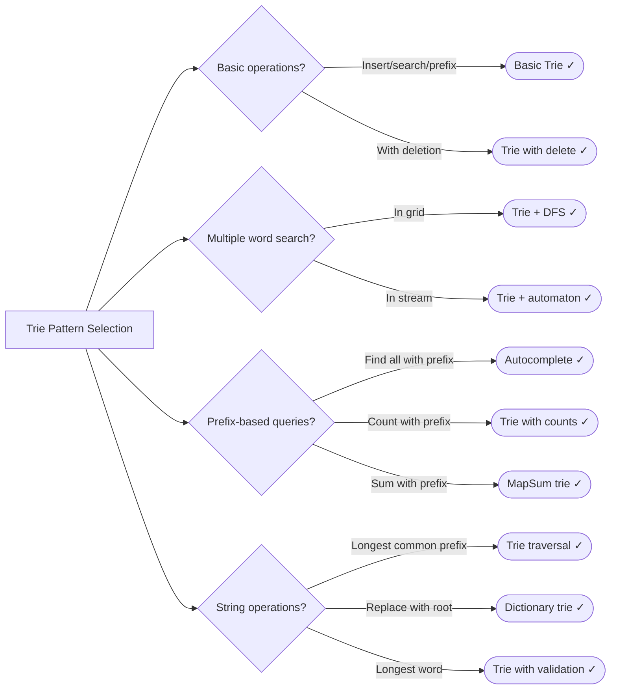

# Tries (Prefix Trees)

> Efficient storage and retrieval of strings with common prefixes using tree structure

---

## Learning Objectives

By the end of this section you will be able to:

- Implement a trie from scratch with insert, search, startsWith, and delete operations
- Explain the space-time tradeoff between tries and hash tables for string operations
- Apply a trie to accelerate multi-word grid search (Word Search II) using shared-prefix pruning
- Build an autocomplete system that retrieves all words matching a given prefix in O(p + k) time
- Select between array-backed and map-backed children representations based on alphabet size and sparsity
- Recognize when tries are the wrong tool and a sorted array or hash set is sufficient

---

## ELI5: Explain Like I'm 5

<div class="learner-section" markdown>

**Your task:** After implementing all patterns, explain them simply.

**Prompts to guide you:**

1. **What is a trie in one sentence?**
    - Your answer: <span class="fill-in">A trie is a tree where each path from root to a marked node spells out ___ by storing ___ at each node so you can find any word in ___ time</span>

2. **How is a trie different from a hash table for strings?**
    - Your answer: <span class="fill-in">A trie shares ___ among words that start the same way, so prefix queries cost ___ instead of ___</span>

3. **Real-world analogy:**
    - Example: "A trie is like how you organize words in a dictionary by first letter, then second letter..."
    - Your analogy: <span class="fill-in">[Fill in]</span>

4. **When does this pattern work?**
    - Your answer: <span class="fill-in">Tries work best when you need ___ queries or must search ___ in a grid, because ___</span>

5. **What's the space-time tradeoff with tries?**
    - Your answer: <span class="fill-in">Tries use O(___) space for n words of average length m, but buy you ___ prefix lookups instead of ___</span>

</div>

---

## Quick Quiz (Do BEFORE implementing)

!!! tip "How to use this section"
    Fill in every blank **before** you read the implementation. Your predictions will be wrong in interesting ways — that gap is where learning happens. Return here after implementing and complete the "Verified" fields.

<div class="learner-section" markdown>

**Your task:** Test your intuition without looking at code. Answer these, then verify after implementation.

### Complexity Predictions

1. **HashMap search for word in dictionary of n words:**
    - Time complexity: <span class="fill-in">[Your guess: O(?)]</span>
    - Verified after learning: <span class="fill-in">[Actual: O(?)]</span>

2. **Trie search for word of length m in dictionary of n words:**
    - Time complexity: <span class="fill-in">[Your guess: O(?)]</span>
    - Space complexity for entire trie: <span class="fill-in">[Your guess: O(?)]</span>
    - Verified: <span class="fill-in">[Actual]</span>

3. **Prefix search comparison:**
    - Find all words starting with "app" using HashMap: <span class="fill-in">[Time: O(?)]</span>
    - Find all words starting with "app" using Trie: <span class="fill-in">[Time: O(?)]</span>
    - Which is faster: <span class="fill-in">[HashMap/Trie - Why?]</span>

### Scenario Predictions

**Scenario 1:** Dictionary has ["apple", "app", "application", "apply"]

- **How many nodes in the trie?** <span class="fill-in">[Count them]</span>
- **Which nodes have isEndOfWord = true?** <span class="fill-in">[List them]</span>
- **How many nodes share the prefix "app"?** <span class="fill-in">[Count]</span>
- **Memory saved compared to storing each word separately?** <span class="fill-in">[Estimate]</span>

**Scenario 2:** Search for "appl" in above dictionary

- **Using search(): returns** <span class="fill-in">[true/false - Why?]</span>
- **Using startsWith(): returns** <span class="fill-in">[true/false - Why?]</span>
- **What's the difference?** <span class="fill-in">[Fill in your reasoning]</span>

**Scenario 3:** Autocomplete with prefix "ap"

- **Which words match?** <span class="fill-in">[List them]</span>
- **Path through trie:** <span class="fill-in">[Describe the traversal]</span>
- **Why is trie better than checking each word?** <span class="fill-in">[Fill in]</span>

### Trade-off Quiz

**Question:** When would HashMap be BETTER than Trie for dictionary?

- Your answer: <span class="fill-in">[Fill in before implementation]</span>
- Verified answer: <span class="fill-in">[Fill in after learning]</span>

**Question:** What's the MAIN advantage of trie over hash table?

- [ ] Faster single word lookup
- [ ] Less space usage
- [ ] Efficient prefix queries
- [ ] Simpler to implement

Verify after implementation: <span class="fill-in">[Which one(s)?]</span>

**Question:** What's the space complexity of trie with n words of average length m?

- [ ] O(n)
- [ ] O(m)
- [ ] O(n * m) worst case
- [ ] O(1)

Verify: <span class="fill-in">[Which one and why?]</span>


</div>

---

## Core Implementation

### Pattern 1: Basic Trie Operations

**Concept:** Build tree where each node represents a character.

**Use case:** Insert, search, prefix search, delete words.

```java
public class BasicTrie {

    /**
     * TrieNode: Basic node structure
     */
    static class TrieNode {
        // TODO: Create children array/map for next characters
        // TODO: Boolean flag for end of word

        TrieNode[] children;
        boolean isEndOfWord;

        TrieNode() {
            // TODO: Initialize children array (size 26 for a-z)
            // TODO: Set isEndOfWord = false
        }
    }

    static class Trie {
        private TrieNode root;

        public Trie() {
            // TODO: Initialize root node
        }

        /**
         * Insert word into trie
         * Time: O(m) where m = word length, Space: O(m)
         *
         * TODO: Implement insert
         */
        public void insert(String word) {
            // TODO: Start from root
            // TODO: Implement iteration/conditional logic
            // TODO: Mark last node as end of word
        }

        /**
         * Search if word exists in trie
         * Time: O(m), Space: O(1)
         *
         * TODO: Implement search
         */
        public boolean search(String word) {
            // TODO: Traverse trie following characters
            // TODO: Return true only if:
            return false; // Replace with implementation
        }

        /**
         * Check if any word starts with prefix
         * Time: O(m), Space: O(1)
         *
         * TODO: Implement startsWith
         */
        public boolean startsWith(String prefix) {
            // TODO: Similar to search
            // TODO: Return true if all characters found
            return false; // Replace with implementation
        }

        /**
         * Delete word from trie
         * Time: O(m), Space: O(m) for recursion
         *
         * TODO: Implement delete
         */
        public boolean delete(String word) {
            // TODO: Use recursive helper
            // TODO: Only delete nodes that aren't part of other words
            return false; // Replace with implementation
        }

        private boolean deleteHelper(TrieNode node, String word, int index) {
            // TODO: Base case: reached end of word

            // TODO: Recursive case:

            return false; // Replace with implementation
        }
    }
}
```

**Runnable Client Code:**

```java
public class BasicTrieClient {

    public static void main(String[] args) {
        System.out.println("=== Basic Trie Operations ===\n");

        BasicTrie.Trie trie = new BasicTrie.Trie();

        // Test 1: Insert and search
        System.out.println("--- Test 1: Insert and Search ---");
        String[] words = {"apple", "app", "application", "apply", "banana"};

        System.out.println("Inserting words:");
        for (String word : words) {
            trie.insert(word);
            System.out.println("  Inserted: " + word);
        }

        System.out.println("\nSearching:");
        String[] searchWords = {"apple", "app", "appl", "ban", "banana"};
        for (String word : searchWords) {
            boolean found = trie.search(word);
            System.out.printf("  search(\"%s\"): %s%n", word, found ? "FOUND" : "NOT FOUND");
        }

        // Test 2: Prefix search
        System.out.println("\n--- Test 2: Prefix Search ---");
        String[] prefixes = {"app", "ban", "cat"};
        for (String prefix : prefixes) {
            boolean hasPrefix = trie.startsWith(prefix);
            System.out.printf("  startsWith(\"%s\"): %s%n", prefix, hasPrefix ? "YES" : "NO");
        }

        // Test 3: Delete
        System.out.println("\n--- Test 3: Delete ---");
        String deleteWord = "app";
        System.out.println("Deleting: " + deleteWord);
        trie.delete(deleteWord);

        System.out.println("After deletion:");
        for (String word : new String[]{"app", "apple", "application"}) {
            boolean found = trie.search(word);
            System.out.printf("  search(\"%s\"): %s%n", word, found ? "FOUND" : "NOT FOUND");
        }
    }
}
```

!!! warning "Debugging Challenge — Missing Node Creation and End-of-Word Flag"

    This insert method is supposed to add words to the trie. It has 2 bugs. Find them!

    ```java
    public void insert_Buggy(String word) {
        TrieNode current = root;

        for (char c : word.toCharArray()) {
            int index = c - 'a';

            if (current.children[index] == null) {
            }

            current = current.children[index];
        }

    }
    ```

    - Bug 1: <span class="fill-in">[What's the bug?]</span>
    - Bug 2: <span class="fill-in">[What's the bug?]</span>

    Test case: insert "app" and "apple", then search("app"). Expected `true`. What do you actually get?
    <span class="fill-in">[Trace through manually]</span>

    ??? success "Answer"

        **Bug 1:** Missing node creation. The `if` block is empty, so children are never allocated:

        ```java
        if (current.children[index] == null) {
            current.children[index] = new TrieNode();
        }
        ```

        **Bug 2:** Missing `current.isEndOfWord = true;` after the loop. Without this, `search` will return `false` even for correctly inserted words.

        **Result:** Without both fixes, `search("app")` returns `false` because `isEndOfWord` is never set.

---

### Pattern 2: Word Search in Grid with Trie

**Concept:** Use trie to efficiently search multiple words in 2D grid.

**Use case:** Word Search II, Boggle game solver.

```java
import java.util.*;

public class WordSearchTrie {

    static class TrieNode {
        Map<Character, TrieNode> children = new HashMap<>();
        String word; // Store word at end node for easy retrieval
    }

    /**
     * Problem: Find all words from dictionary in 2D grid
     * Time: O(m*n*4^L) where L = max word length, Space: O(k*L) where k = words
     *
     * TODO: Implement word search II
     */
    public static List<String> findWords(char[][] board, String[] words) {
        // TODO: Build trie from words array
        // TODO: DFS from each cell using trie for pruning
        // TODO: Mark visited cells during DFS
        // TODO: Add found words to result (use Set to avoid duplicates)

        return new ArrayList<>(); // Replace with implementation
    }

    private static TrieNode buildTrie(String[] words) {
        // TODO: Create root node
        // TODO: Insert each word into trie
        // TODO: Store complete word at end node
        return new TrieNode(); // Replace with implementation
    }

    private static void dfs(char[][] board, int i, int j, TrieNode node,
                           Set<String> result, boolean[][] visited) {
        // TODO: Check bounds and visited
        // TODO: Get character at current position
        // TODO: Check if character exists in trie children
        // TODO: Implement iteration/conditional logic
        // TODO: Mark visited
        // TODO: DFS in 4 directions
        // TODO: Unmark visited (backtrack)
    }

    /**
     * Problem: Longest word in dictionary built one char at a time
     * Time: O(n * L), Space: O(n * L)
     *
     * TODO: Implement longest word
     */
    public static String longestWord(String[] words) {
        // TODO: Build trie
        // TODO: DFS/BFS to find longest word where all prefixes exist
        // TODO: Each character must form a valid word

        return ""; // Replace with implementation
    }
}
```

**Runnable Client Code:**

```java
import java.util.*;

public class WordSearchTrieClient {

    public static void main(String[] args) {
        System.out.println("=== Word Search with Trie ===\n");

        // Test 1: Word Search II
        System.out.println("--- Test 1: Word Search II ---");
        char[][] board = {
            {'o','a','a','n'},
            {'e','t','a','e'},
            {'i','h','k','r'},
            {'i','f','l','v'}
        };

        String[] words = {"oath", "pea", "eat", "rain", "oat"};

        System.out.println("Board:");
        for (char[] row : board) {
            for (char c : row) {
                System.out.print(c + " ");
            }
            System.out.println();
        }

        System.out.println("\nDictionary: " + Arrays.toString(words));

        List<String> found = WordSearchTrie.findWords(board, words);
        System.out.println("Found words: " + found);

        // Test 2: Longest word
        System.out.println("\n--- Test 2: Longest Word ---");
        String[][] wordSets = {
            {"w", "wo", "wor", "worl", "world"},
            {"a", "banana", "app", "appl", "ap", "apply", "apple"}
        };

        for (String[] wordSet : wordSets) {
            String longest = WordSearchTrie.longestWord(wordSet);
            System.out.printf("Words: %s%n", Arrays.toString(wordSet));
            System.out.printf("Longest: \"%s\"%n%n", longest);
        }
    }
}
```

!!! warning "Debugging Challenge — Missing Boundary Check in Grid DFS"

    This DFS for word search in grid has 1 critical bug:

    ```java
    private void dfs_Buggy(char[][] board, int i, int j, TrieNode node,
                          Set<String> result, boolean[][] visited) {

        char c = board[i][j];

        if (!node.children.containsKey(c)) {
            return;
        }

        visited[i][j] = true;
        TrieNode next = node.children.get(c);

        if (next.word != null) {
            result.add(next.word);
        }

        dfs_Buggy(board, i + 1, j, next, result, visited);
        dfs_Buggy(board, i - 1, j, next, result, visited);
        dfs_Buggy(board, i, j + 1, next, result, visited);
        dfs_Buggy(board, i, j - 1, next, result, visited);

        visited[i][j] = false;
    }
    ```

    - Bug: <span class="fill-in">[What's the bug?]</span>
    - Test case: grid `[['a','b'],['c','d']]`, dictionary `["ab"]`. What error occurs? <span class="fill-in">[Fill in]</span>

    ??? success "Answer"

        **Bug:** Boundary and visited checks are missing at the START of the function. The code accesses `board[i][j]` before checking whether `i` and `j` are valid indices, causing `ArrayIndexOutOfBoundsException` on every recursive call that goes out of bounds.

        ```java
        private void dfs(char[][] board, int i, int j, TrieNode node,
                        Set<String> result, boolean[][] visited) {
            // Check bounds and visited FIRST
            if (i < 0 || i >= board.length || j < 0 || j >= board[0].length || visited[i][j]) {
                return;
            }
            // ... rest of method
        }
        ```

        Without this guard, all four recursive calls at the boundary immediately crash rather than returning cleanly.

---

### Pattern 3: Autocomplete and Prefix Matching

**Concept:** Find all words with given prefix.

**Use case:** Autocomplete, suggestions, prefix search.

```java
import java.util.*;

public class Autocomplete {

    static class TrieNode {
        Map<Character, TrieNode> children = new HashMap<>();
        boolean isEndOfWord;
        String word; // Store full word for easy retrieval
    }

    static class AutocompleteTrie {
        private TrieNode root;

        public AutocompleteTrie() {
            root = new TrieNode();
        }

        /**
         * Insert word
         * Time: O(m), Space: O(m)
         *
         * TODO: Implement insert
         */
        public void insert(String word) {
            // TODO: Standard trie insert
            // TODO: Store word at end node
        }

        /**
         * Find all words with given prefix
         * Time: O(p + n) where p=prefix length, n=results, Space: O(n)
         *
         * TODO: Implement autocomplete
         */
        public List<String> autocomplete(String prefix) {
            List<String> results = new ArrayList<>();

            // TODO: Navigate to end of prefix
            // TODO: Implement iteration/conditional logic
            // TODO: DFS from prefix node to collect all words
            // TODO: Return results

            return results; // Replace with implementation
        }

        private void collectWords(TrieNode node, List<String> results) {
            // TODO: Implement iteration/conditional logic
            // TODO: DFS all children
        }

        /**
         * Find top K most frequent words with prefix
         * Time: O(p + n log k), Space: O(n)
         *
         * TODO: Implement top K suggestions
         */
        public List<String> topKSuggestions(String prefix, int k) {
            // TODO: Get all words with prefix
            // TODO: Use min-heap to track top K by frequency
            // TODO: Return top K

            return new ArrayList<>(); // Replace with implementation
        }
    }

    /**
     * Problem: Search suggestions system
     * Time: O(m*n) where m=products, n=searchWord length, Space: O(m*n)
     *
     * TODO: Implement search suggestions
     */
    public static List<List<String>> suggestedProducts(String[] products, String searchWord) {
        // TODO: Build trie from products
        // TODO: Implement iteration/conditional logic
        // TODO: Return list of suggestions for each prefix

        return new ArrayList<>(); // Replace with implementation
    }
}
```

**Runnable Client Code:**

```java
import java.util.*;

public class AutocompleteClient {

    public static void main(String[] args) {
        System.out.println("=== Autocomplete ===\n");

        // Test 1: Basic autocomplete
        System.out.println("--- Test 1: Basic Autocomplete ---");
        Autocomplete.AutocompleteTrie trie = new Autocomplete.AutocompleteTrie();

        String[] dictionary = {
            "apple", "application", "apply", "app",
            "banana", "band", "bandana", "ban"
        };

        System.out.println("Dictionary:");
        for (String word : dictionary) {
            trie.insert(word);
            System.out.println("  " + word);
        }

        String[] prefixes = {"app", "ban", "cat"};
        System.out.println("\nAutocomplete:");
        for (String prefix : prefixes) {
            List<String> suggestions = trie.autocomplete(prefix);
            System.out.printf("  \"%s\" -> %s%n", prefix, suggestions);
        }

        // Test 2: Search suggestions system
        System.out.println("\n--- Test 2: Search Suggestions System ---");
        String[] products = {"mobile", "mouse", "moneypot", "monitor", "mousepad"};
        String searchWord = "mouse";

        System.out.println("Products: " + Arrays.toString(products));
        System.out.println("Search word: " + searchWord);

        List<List<String>> suggestions = Autocomplete.suggestedProducts(products, searchWord);
        System.out.println("Suggestions for each prefix:");
        for (int i = 0; i < suggestions.size(); i++) {
            System.out.printf("  \"%s\" -> %s%n",
                searchWord.substring(0, i + 1), suggestions.get(i));
        }
    }
}
```

---

### Pattern 4: Advanced Trie Applications

**Concept:** Use tries for complex string operations.

**Use case:** Longest common prefix, map sum pairs, replace words.

```java
import java.util.*;

public class AdvancedTrie {

    /**
     * Problem: Longest common prefix of all strings
     * Time: O(S) where S = sum of all characters, Space: O(S)
     *
     * TODO: Implement using trie
     */
    public static String longestCommonPrefix(String[] strs) {
        // TODO: Build trie from all strings
        // TODO: Traverse trie while:
        // TODO: Return prefix

        return ""; // Replace with implementation
    }

    /**
     * MapSum: Sum of values with given prefix
     *
     * TODO: Implement map sum trie
     */
    static class MapSum {
        // TODO: TrieNode with value at each node
        // TODO: Store running sum at each node

        static class TrieNode {
            Map<Character, TrieNode> children = new HashMap<>();
            int value; // Value of word ending here
            int sum; // Sum of all words with this prefix
        }

        private TrieNode root;

        public MapSum() {
            // TODO: Initialize root
        }

        /**
         * Insert key with value
         * Time: O(m), Space: O(m)
         */
        public void insert(String key, int val) {
            // TODO: Navigate/create path for key
            // TODO: Update sum at each node
            // TODO: Store value at end node
        }

        /**
         * Sum of all values with given prefix
         * Time: O(m), Space: O(1)
         */
        public int sum(String prefix) {
            // TODO: Navigate to end of prefix
            // TODO: Return sum at that node
            return 0; // Replace with implementation
        }
    }

    /**
     * Problem: Replace words with shortest root from dictionary
     * Time: O(N + S), Space: O(N)
     *
     * TODO: Implement replace words
     */
    public static String replaceWords(List<String> dictionary, String sentence) {
        // TODO: Build trie from dictionary
        // TODO: Implement iteration/conditional logic
        // TODO: Return modified sentence

        return ""; // Replace with implementation
    }
}
```

**Runnable Client Code:**

```java
import java.util.*;

public class AdvancedTrieClient {

    public static void main(String[] args) {
        System.out.println("=== Advanced Trie ===\n");

        // Test 1: Longest common prefix
        System.out.println("--- Test 1: Longest Common Prefix ---");
        String[][] stringSets = {
            {"flower", "flow", "flight"},
            {"dog", "racecar", "car"},
            {"interview", "internet", "interval"}
        };

        for (String[] strs : stringSets) {
            String lcp = AdvancedTrie.longestCommonPrefix(strs);
            System.out.printf("Strings: %s%n", Arrays.toString(strs));
            System.out.printf("LCP: \"%s\"%n%n", lcp);
        }

        // Test 2: Map sum
        System.out.println("--- Test 2: Map Sum ---");
        AdvancedTrie.MapSum mapSum = new AdvancedTrie.MapSum();

        mapSum.insert("apple", 3);
        System.out.println("insert(\"apple\", 3)");
        System.out.println("sum(\"ap\"): " + mapSum.sum("ap"));

        mapSum.insert("app", 2);
        System.out.println("insert(\"app\", 2)");
        System.out.println("sum(\"ap\"): " + mapSum.sum("ap"));

        // Test 3: Replace words
        System.out.println("\n--- Test 3: Replace Words ---");
        List<String> dictionary = Arrays.asList("cat", "bat", "rat");
        String sentence = "the cattle was rattled by the battery";

        System.out.println("Dictionary: " + dictionary);
        System.out.println("Sentence: " + sentence);

        String replaced = AdvancedTrie.replaceWords(dictionary, sentence);
        System.out.println("Result: " + replaced);
    }
}
```

---

## Before/After: Why This Pattern Matters

**Your task:** Compare naive vs optimized approaches to understand the impact.

### Example: Autocomplete System

**Problem:** Find all words in dictionary that start with given prefix.

#### Approach 1: HashMap with Linear Scan

```java
// Naive approach - Check every word
public static List<String> autocomplete_Naive(Set<String> dictionary, String prefix) {
    List<String> results = new ArrayList<>();

    // Check every word in dictionary
    for (String word : dictionary) {
        if (word.startsWith(prefix)) {
            results.add(word);
        }
    }

    return results;
}
```

**Analysis:**

- Time: O(n * m) - Check n words, each comparison takes m characters
- Space: O(1) additional space (not counting results)
- For dictionary with 100,000 words, prefix length 3: ~300,000 character comparisons

#### Approach 2: Trie (Optimized)

```java
// Optimized approach - Navigate to prefix then collect
public List<String> autocomplete_Trie(String prefix) {
    List<String> results = new ArrayList<>();

    // Navigate to prefix node: O(p) where p = prefix length
    TrieNode node = root;
    for (char c : prefix.toCharArray()) {
        if (!node.children.containsKey(c)) {
            return results; // Prefix not found
        }
        node = node.children.get(c);
    }

    // Collect all words under this node: O(k) where k = results
    collectWords(node, prefix, results);

    return results;
}
```

**Analysis:**

- Time: O(p + k) - p = prefix length, k = number of results
- Space: O(n * m) for trie structure
- For same dictionary, prefix length 3: Only 3 comparisons + collecting results

#### Performance Comparison

| Dictionary Size | Prefix Length | HashMap (O(n*m)) | Trie (O(p+k)) | Speedup |
|-----------------|---------------|------------------|---------------|---------|
| n = 1,000       | m = 5         | 5,000 ops        | 5 + k ops     | 1000x   |
| n = 10,000      | m = 5         | 50,000 ops       | 5 + k ops     | 10000x  |
| n = 100,000     | m = 5         | 500,000 ops      | 5 + k ops     | 100000x |

**Your calculation:** For n = 50,000 and prefix length 4, the speedup is approximately _____ times faster.

#### Why Does Trie Work?

**Key insight to understand:**

Building dictionary: ["apple", "app", "application", "apply", "banana"]

```
Trie structure:
        root
       /    \
      a      b
      |      |
      p      a
      |      |
      p*     n
     / \     |
    l   l    a
    |   |    |
    e*  y*   n
    |        |
    a        a*
    |
    t
    |
    i
    |
    o
    |
    n*

(* = isEndOfWord)
```

**Autocomplete for "app":**

```
Step 1: Navigate to 'a' → 'p' → 'p' (3 steps only!)
Step 2: Collect all words from this subtree
Found: "app", "apple", "application", "apply"
```

**Why can we skip other words?**

- Words not starting with 'a' are in different branch (never visited)
- Words starting with 'a' but not 'ap' are in different branch (never visited)
- Only visit nodes relevant to prefix - massive pruning!

**After implementing, explain in your own words:**

<div class="learner-section" markdown>

- Why is trie better for prefix queries than hash table? <span class="fill-in">[Your answer]</span>
- What's the space-time tradeoff? <span class="fill-in">[Your answer]</span>
- When would hash table still be better? <span class="fill-in">[Your answer]</span>

</div>

---

### Example: Word Search in Grid

**Problem:** Find all words from dictionary in 2D character grid.

#### Approach 1: Brute Force with Hash Set

```java
// Naive approach - DFS from each cell for each word
public static List<String> findWords_BruteForce(char[][] board, String[] words) {
    Set<String> wordSet = new HashSet<>(Arrays.asList(words));
    Set<String> found = new HashSet<>();

    // Try to find each word starting from each cell
    for (int i = 0; i < board.length; i++) {
        for (int j = 0; j < board[0].length; j++) {
            for (String word : words) {
                if (dfsSearch(board, i, j, word, 0, new boolean[board.length][board[0].length])) {
                    found.add(word);
                }
            }
        }
    }

    return new ArrayList<>(found);
}
```

**Analysis:**

- Time: O(w * m * n * 4^L) - w words, m*n cells, 4^L DFS
- For 1000 words, 4x4 grid, word length 10: Extremely slow
- No early pruning - explores impossible paths

#### Approach 2: Trie with DFS (Optimized)

```java
// Optimized approach - Single DFS using trie for pruning
public List<String> findWords_Trie(char[][] board, String[] words) {
    // Build trie once: O(w * L)
    TrieNode root = buildTrie(words);
    Set<String> found = new HashSet<>();

    // DFS from each cell, trie prunes invalid paths
    for (int i = 0; i < board.length; i++) {
        for (int j = 0; j < board[0].length; j++) {
            dfs(board, i, j, root, found, new boolean[board.length][board[0].length]);
        }
    }

    return new ArrayList<>(found);
}

// Trie prunes branches early - if prefix doesn't exist in trie, stop!
```

**Analysis:**

- Time: O(m * n * 4^L) - Only one DFS per cell
- Trie pruning: If "xy" not in dictionary, never explore "xyz", "xya", etc.
- For same problem: 1000x faster with early pruning

#### Performance Comparison

| Dictionary Size | Grid Size | Brute Force  | Trie with Pruning | Speedup |
|-----------------|-----------|--------------|-------------------|---------|
| 100 words       | 3x3       | ~100,000 ops | ~1,000 ops        | 100x    |
| 1,000 words     | 4x4       | ~10,000,000  | ~10,000 ops       | 1000x   |
| 10,000 words    | 5x5       | Timeout      | ~100,000 ops      | 100x+   |

!!! note "Key insight"
    The trie converts the word-search problem from "check the grid for each word" to "explore the grid once, and let the trie tell you when to stop." Every node in the trie represents a shared prefix decision, so the pruning multiplies across all words simultaneously.

**After implementing, explain in your own words:**

<div class="learner-section" markdown>

- How does trie enable early pruning in DFS? <span class="fill-in">[Your answer]</span>
- Why is single DFS with trie better than multiple DFS? <span class="fill-in">[Your answer]</span>

</div>

---

!!! info "Loop back"
    Return to the Quick Quiz above and fill in every "Verified" field. Then revisit your ELI5 answers — can you now state the space-time tradeoff precisely?

---

## Case Studies

### Google Search Autocomplete

Google's suggestion box must return completions within ~100ms for a corpus of billions of queries. A raw hash-table approach would require scanning all stored queries for each keystroke — far too slow. The production system uses a trie (combined with frequency counts and personalization signals) to navigate directly to the relevant prefix subtree, then return the top-k completions ranked by popularity. The O(p + k) query cost is independent of corpus size, which is what makes interactive latency feasible.

### IDE Code Completion

IntelliJ IDEA and VS Code both use trie-like structures in their symbol indexes. When you type `con` in a Java file, the editor navigates to the "con" node in the project symbol trie and returns all matching class names, method names, and variables. Without prefix sharing, searching millions of symbols on every keystroke would stall the UI. The trie structure also supports wildcard patterns (e.g., camel-case abbreviation matching) by storing multiple index paths per symbol.

### DNS Lookup and IP Routing

Internet routers store routing tables as tries keyed on binary IP address prefixes. A packet destined for `192.168.1.42` is routed by traversing a binary trie bit-by-bit, following the longest matching prefix to find the correct outgoing interface. This is called a longest-prefix match. The trie structure makes it possible to search a table of hundreds of thousands of routes in O(32) steps (for IPv4) regardless of table size, which is essential for line-rate packet forwarding.

---

## Common Misconceptions

!!! warning "Misconception: search() and startsWith() are the same"
    Both methods traverse the trie following each character, so the traversal code looks identical. The difference is only in the return condition: `search` requires `node.isEndOfWord == true` at the final node, while `startsWith` returns `true` as soon as all prefix characters are found. Forgetting to check `isEndOfWord` in `search` causes it to return `true` for any prefix of an inserted word, even one that was never inserted itself.

!!! warning "Misconception: tries always use less memory than hash tables"
    For large alphabets (e.g., Unicode) or sparse word sets, a trie using an array-backed `children[26]` allocates 26 pointers per node even when most are null. A dictionary of 1,000 English words can easily consume more memory as a trie than as a hash set of strings. Map-backed children (`HashMap<Character, TrieNode>`) reduce wasted space for sparse tries but add per-entry overhead. The right choice depends on alphabet density and access patterns.

!!! warning "Misconception: you can delete a node as soon as isEndOfWord is cleared"
    Clearing `isEndOfWord` is necessary but not sufficient. If the deleted word shares a prefix with another inserted word (e.g., deleting "app" when "apple" exists), the intermediate nodes must be preserved. Nodes should only be physically removed when they have no children and are not themselves the end of another word. Incorrect deletion leaves dangling nodes that waste memory, or worse, removes nodes still needed by other words.

---

## Decision Framework

**Your task:** Build decision trees for trie problems.

### Question 1: What operations do you need?

Answer after solving problems:

- **Insert/search single word?** <span class="fill-in">[Basic trie]</span>
- **Prefix search?** <span class="fill-in">[Trie with prefix traversal]</span>
- **Find all words with prefix?** <span class="fill-in">[Autocomplete trie]</span>
- **Multiple word search in grid?** <span class="fill-in">[Trie + DFS]</span>

### Question 2: What are the constraints?

**Space critical:**

- Use: <span class="fill-in">[Hash map for children (sparse)]</span>
- Avoid: <span class="fill-in">[Array for children (dense)]</span>

**Need frequency/values:**

- Store: <span class="fill-in">[Additional data at nodes]</span>
- Examples: <span class="fill-in">[MapSum, frequency trie]</span>

**Need to delete:**

- Implement: <span class="fill-in">[Recursive deletion with cleanup]</span>

### Your Decision Tree



---

## Practice

### LeetCode Problems

**Easy (Complete all 2):**

- [ ] [208. Implement Trie](https://leetcode.com/problems/implement-trie-prefix-tree/)
    - Pattern: <span class="fill-in">[Basic trie]</span>
    - Your solution time: <span class="fill-in">___</span>
    - Key insight: <span class="fill-in">[Fill in after solving]</span>

- [ ] [720. Longest Word in Dictionary](https://leetcode.com/problems/longest-word-in-dictionary/)
    - Pattern: <span class="fill-in">[Trie with validation]</span>
    - Your solution time: <span class="fill-in">___</span>
    - Key insight: <span class="fill-in">[Fill in]</span>

**Medium (Complete 3-4):**

- [ ] [211. Design Add and Search Words Data Structure](https://leetcode.com/problems/design-add-and-search-words-data-structure/)
    - Pattern: <span class="fill-in">[Trie with wildcard]</span>
    - Difficulty: <span class="fill-in">[Rate 1-10]</span>
    - Key insight: <span class="fill-in">[Fill in]</span>

- [ ] [212. Word Search II](https://leetcode.com/problems/word-search-ii/)
    - Pattern: <span class="fill-in">[Trie + DFS]</span>
    - Difficulty: <span class="fill-in">[Rate 1-10]</span>
    - Key insight: <span class="fill-in">[Fill in]</span>

- [ ] [1268. Search Suggestions System](https://leetcode.com/problems/search-suggestions-system/)
    - Pattern: <span class="fill-in">[Autocomplete]</span>
    - Difficulty: <span class="fill-in">[Rate 1-10]</span>
    - Key insight: <span class="fill-in">[Fill in]</span>

- [ ] [648. Replace Words](https://leetcode.com/problems/replace-words/)
    - Pattern: <span class="fill-in">[Dictionary trie]</span>
    - Difficulty: <span class="fill-in">[Rate 1-10]</span>
    - Key insight: <span class="fill-in">[Fill in]</span>

**Hard (Optional):**

- [ ] [472. Concatenated Words](https://leetcode.com/problems/concatenated-words/)
    - Pattern: <span class="fill-in">[Trie + DP]</span>
    - Key insight: <span class="fill-in">[Fill in after solving]</span>

- [ ] [1707. Maximum XOR With an Element From Array](https://leetcode.com/problems/maximum-xor-with-an-element-from-array/)
    - Pattern: <span class="fill-in">[Binary trie]</span>
    - Key insight: <span class="fill-in">[Fill in after solving]</span>

---

## Test Your Understanding

Answer these after completing the implementations and practice problems. Return here and fill in your answers without looking at notes.

1. **What is the time complexity of inserting a word of length m into a trie, and why does it not depend on the number of words already in the trie?**
   <span class="fill-in">[Your answer]</span>

2. **A colleague writes `return true` at the end of search() instead of `return node.isEndOfWord`. Give a concrete example where this produces a wrong answer and explain why.**
   <span class="fill-in">[Your answer]</span>

3. **You have a dictionary of 50,000 English words and need to support autocomplete queries. Should you use a trie with array-backed children (size 26) or map-backed children? Justify your answer by estimating the memory difference.**
   <span class="fill-in">[Your answer]</span>

4. **Explain why a single DFS with a trie over a grid is faster than running a separate DFS for each word. What specifically does the trie prune?**
   <span class="fill-in">[Your answer]</span>

5. **You delete the word "app" from a trie that also contains "apple". Which nodes should be physically removed, and which must be preserved? Walk through the deleteHelper logic to justify your answer.**
   <span class="fill-in">[Your answer]</span>
