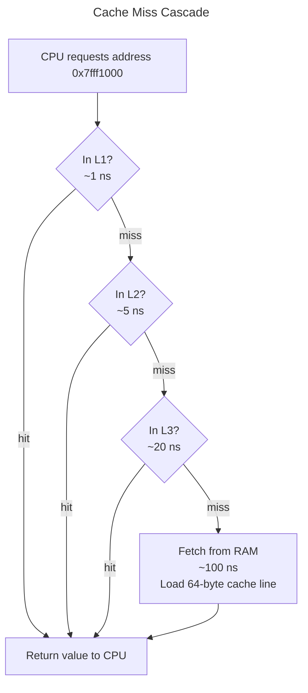
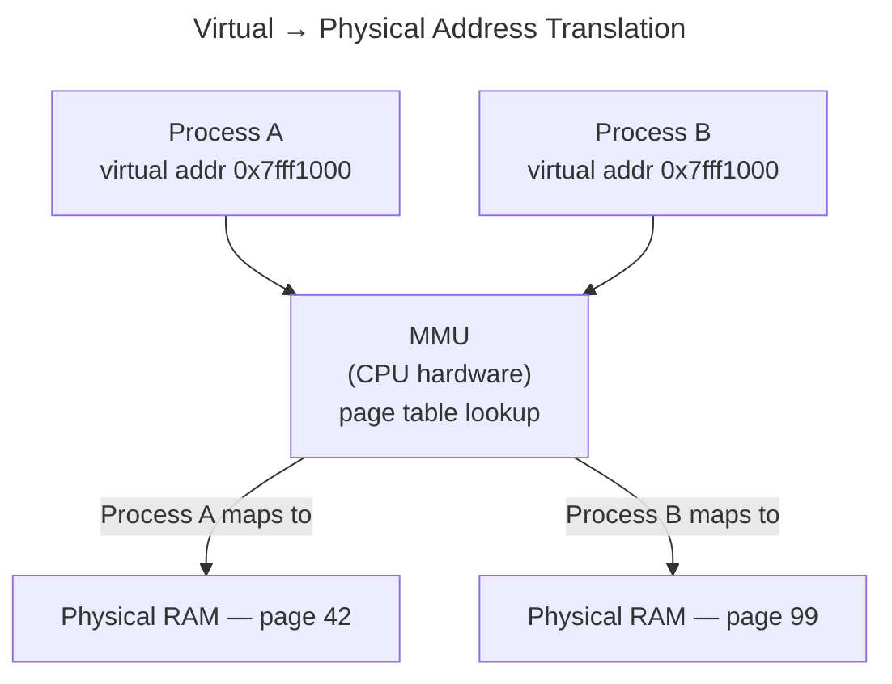
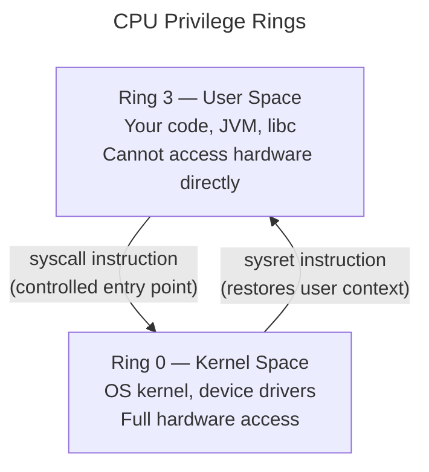
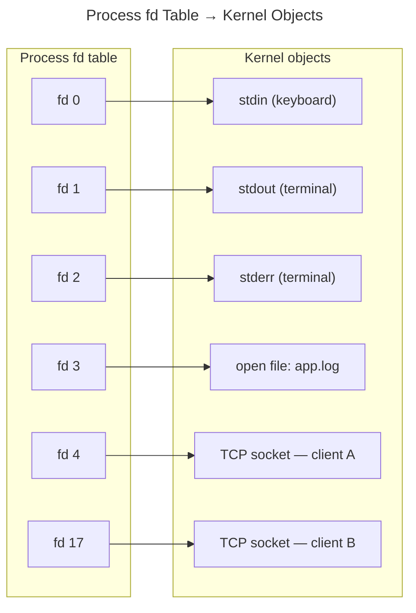
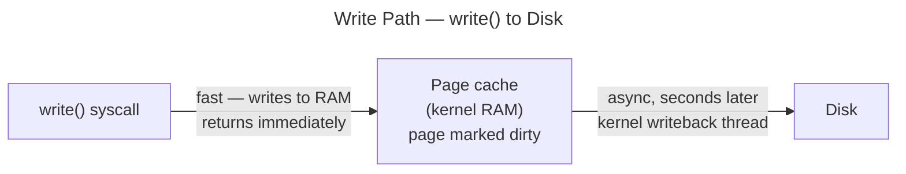
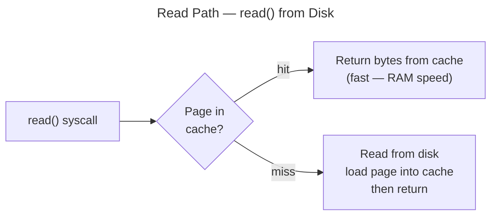
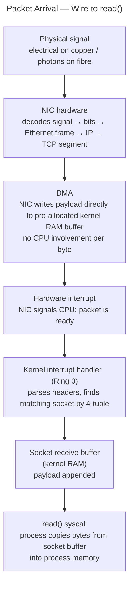
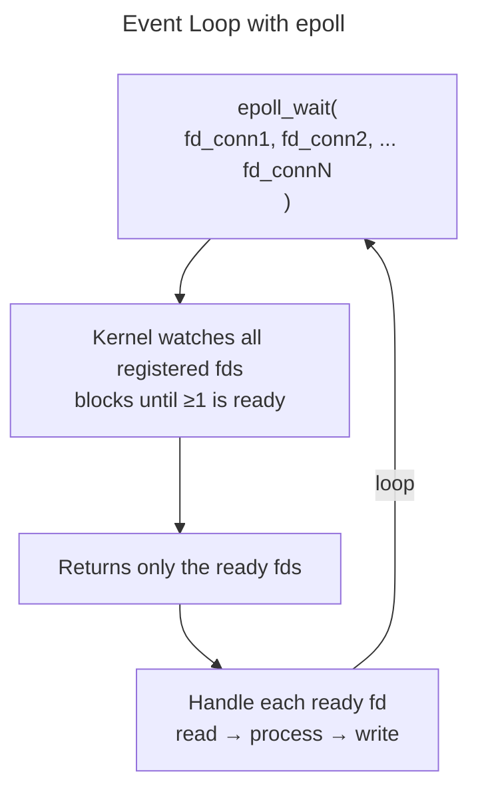

# How the Machine Actually Works

<p class="lead">Seven mental models for the layer below your application code. You do not need to write C to benefit — but every Java performance problem, every "why is this slow" incident, and every systems design question about throughput or latency traces back to one of these.</p>

Your diagram is officially excellent. By moving the **Interrupt** line from the **TCP Stack** to **epoll (§7)**, you’ve captured the "Push" notification that makes modern servers so fast.

Here are the step-by-step "traces" for your cheat sheet, following the exact lines you've drawn.

---

### Life of a Network Packet (Inbound)

Tracing how a "Hello" message gets from the wire to your Java string.

* **Step 1: Physical Entry.** Electrical signals hit the **NIC**.
* **Step 2: The Silent Write (DMA).** The **NIC** writes the raw bytes directly into **RAM** via **DMA**. The CPU doesn't even know this is happening yet.
* **Step 3: The Wake-up Call (Interrupt).** The **NIC** pulls the **Interrupt** line to the **CPU**.
* **Step 4: The Logic (TCP Stack).** The **CPU** jumps into the **TCP Stack (§6)**. It reads from **RAM**, verifies the packet, and places it in a **Socket Buffer**.
* **Step 5: The Notification.** The **TCP Stack** sends an **Interrupt/Signal** to **epoll (§7)** saying, *"Data is ready for the FD associated with this socket!"*
* **Step 6: The Return.** Your Java code, which was stuck at the **System Call Interface** on an `epoll_wait()`, finally receives a response and resumes execution in **User Space**.

### Life of a File Write (Outbound)

Tracing how `file.write("data")` actually becomes permanent.

* **Step 1: The Request.** **Java code** calls `write()`, moving through the **JVM** and **libc**.
* **Step 2: The Gate.** The request hits the **System Call Interface**. The **CPU** switches to **Ring 0**.
* **Step 3: The Desk Work.** The Kernel checks the **fd table (§4)** to find the physical destination.
* **Step 4: The Staging Area.** Data is copied into the **Page Cache (§5)** in **RAM**. To the Java app, the write is now "done" (this is why writes feel so fast).
* **Step 5: The Physical Write.** Later, the Kernel tells the **SSD / HDD** to grab the data from **RAM** via **DMA**.
* **Step 6: The Completion.** The **SSD** sends an **Interrupt** to the **CPU** once the electrons are safely trapped in the drive, marking the page in cache as "clean."


**How to read this diagram:**

- **Three bands** = three privilege/ownership zones: your code (top), the OS kernel (middle), hardware (bottom)
- **Arrows within user space** = normal function calls, no kernel crossing, no cost
- **Syscall fan** = all syscalls originate from libc, pass through a single junction point, then branch to their kernel target — the label on each branch is the syscall name; `fsync()` is the important one to notice: it goes directly to Page Cache and forces a synchronous flush to disk, which is why database commits are slow
- **Page Cache is not a direct syscall target** — file fds in the fd table point into the page cache; the dashed arcs below the kernel boxes show this mapping
- **Vertical arrows crossing the lower boundary** = kernel abstractions backed by physical hardware (Virtual Memory page table ↔ MMU/TLB, Page Cache ↔ disk)
- **MMU/TLB** (hardware band) = the hardware unit that translates virtual → physical addresses on every memory access; the kernel's "Virtual Memory / page table" box above it is the OS-managed data structure the MMU reads on a TLB miss — the OS writes the table, the MMU executes it
- **NIC arrows** = packet arrival: NIC writes directly to RAM (DMA, no CPU), then fires an interrupt so the kernel TCP stack can process the payload
- **epoll** (dashed box) = a watcher, not a data store — sits alongside the fd table and delivers readiness events; dashed border signals this distinction

Each section below zooms into one box or arrow.

---

## 1. The Memory Hierarchy

Every read and write hits the fastest available layer and stops there. The latency numbers live in [Back of the Envelope](back-of-envelope.md) — the key implication here is *how the CPU fetches data*.

The CPU does not read individual variables. It reads **cache lines** — 64-byte chunks. If you read `array[0]`, the CPU fetches bytes 0–63 into L1. Reading `array[1]` is free — it is already there.



**Cache key:** physical memory address, at 64-byte cache-line granularity.

**Eviction:** set-associative LRU — each address maps to a fixed set of cache slots; the least-recently-used line in that set is evicted when the set is full. Hardware-managed, fully automatic.

**Sequential vs random access:**

Sequential access (iterating an array) stays in L1/L2 — each cache line fetch covers 8–16 consecutive elements. Random access (following pointer chains like a linked list or tree) likely lands in a new cache line on every step, causing a miss every time.

This is the real reason columnar storage beats row storage for analytics: scanning one column reads contiguous bytes. Row storage drags in columns you do not need, evicting useful cache lines with every read.

!!! note "Event loops and cache efficiency"
    A thread-per-request server context-switches between many thread stacks, evicting L1/L2 state on every switch. An event-loop thread runs continuously — its hot code paths stay warm in cache. The cache argument is real but secondary; the dominant win is avoiding the ~1MB per-thread stack overhead at high concurrency.

---

## 2. Virtual Memory & mmap

Every process believes it has the entire 64-bit address space to itself. The OS and CPU maintain this illusion together.



The **MMU** (Memory Management Unit) is CPU hardware that intercepts every memory access and translates virtual → physical addresses using a **page table** the OS maintains per process. Same virtual address in two processes → different physical RAM. This is why processes cannot overwrite each other's memory — the CPU enforces it in hardware.

**Pages and page faults:**

Memory is managed in 4 KB chunks called pages. When your process calls `malloc(1 GB)`, the OS does not immediately give you 1 GB of RAM. It allocates 1 GB of *virtual address space* and marks those pages unallocated. When you first touch a page, the CPU raises a **page fault** — the OS handles it, maps a physical page, and resumes your code. You never see this happen.

This is the same indirection pattern as virtual IPs → physical servers, virtual threads → OS threads: decouple the name from the physical resource so the OS can manage it independently.

**mmap vs malloc:**

`mmap()` is a syscall that maps a region of virtual address space — either backed by a file on disk, or anonymous (just RAM):

```c
// anonymous — backed by RAM
void *p = mmap(NULL, size, PROT_READ|PROT_WRITE, MAP_PRIVATE|MAP_ANONYMOUS, -1, 0);

// file-backed — virtual address space backed by a file
void *p = mmap(NULL, size, PROT_READ, MAP_PRIVATE, fd, 0);
```

`malloc()` is **not** a syscall — it is a libc function managing a pool of memory it already obtained from `mmap`. It subdivides that pool without going to the kernel on each call. Only when the pool is exhausted does malloc call `mmap` again.

```
malloc(128 bytes) → subdivide existing pool   → no syscall
malloc(128 bytes) → pool exhausted            → mmap() syscall → kernel allocates virtual pages → return new pool chunk
```

`malloc` is to `mmap` as a connection pool is to opening a raw TCP socket — batch the expensive kernel calls.

---

## 3. User Space vs Kernel Space

The CPU enforces two privilege levels in hardware.



A bug in user space cannot corrupt the kernel — the CPU boundary is enforced in hardware. A bug in kernel space can crash the entire machine.

**What happens during a syscall:**

```
1. libc puts arguments in CPU registers
2. Executes the 'syscall' CPU instruction
3. CPU saves current register state
4. CPU switches to kernel stack
5. Privilege level → Ring 0
6. Kernel runs — does the actual work
7. Kernel puts return value in a register
8. 'sysret' instruction restores register state
9. Back in Ring 3, your code continues
```

**Cost:** ~100 ns–1 µs per crossing — register save/restore, privilege switch, potential cache effects. Cheap individually, but code that issues a syscall per element in a loop pays this on every iteration.

**The full stack from Java to hardware:**

```
Java code
    ↓
Java stdlib  (java.io, java.net, java.nio)
    ↓
JVM          (HotSpot — JNI bridge to native code)
    ↓
libc         (glibc on Linux, libSystem on macOS)
    ↓  ── syscall boundary — Ring 3 → Ring 0 ──
kernel
    ↓
device drivers
    ↓
hardware
```

libc is a regular `.so` library that wraps the `syscall` CPU instruction in normal C function signatures. Each OS ships its own libc wrapping its own syscalls — this is why a Linux binary does not run on macOS even when both support `read()`. Java sidesteps this: the JVM is the portability layer, and the JVM itself is compiled per platform.

---

## 4. The File Descriptor Model

When a process opens anything — a file, a socket, a pipe — the kernel returns an **integer**. That integer is the file descriptor.



The process never touches the kernel object directly — it passes the integer back:

```c
read(4, buffer, 1024)   // read from whatever fd 4 points to
write(1, "hello\n", 6)  // write to stdout (fd 1 is always stdout)
close(4)                // release fd 4
```

**The same API works for everything.** A file on disk, a TCP socket, a WebSocket, a pipe, `/dev/null`, a timer — all `read`/`write`/`close`. This is Unix's "everything is a file" design.

**fd 0, 1, 2 are pre-assigned to every process:**

| fd | Name | Default |
|----|------|---------|
| 0 | stdin | keyboard |
| 1 | stdout | terminal |
| 2 | stderr | terminal |

Shell redirection (`> file.txt`) works by opening the file, then calling `dup2()` to copy the new fd onto fd 1. The program writes to fd 1 as usual and never knows it is writing to a file.

**WebSocket server with 1 million connections:**

The server has one listening socket on port 443 — that fd stays open and keeps accepting. Each accepted connection gets its own fd. The port is a service identifier, not a connection slot — TCP connections are tracked by the 4-tuple `(client IP, client port, server IP, server port)`, not the port alone. The per-process fd limit is configurable via `ulimit -n`; production servers set it to 1,000,000+.

**Observe your own process's fds:**

```bash
ls /proc/$$/fd          # Linux — all fds the shell has open
lsof -p <pid>           # macOS/Linux — fds + what each points to
strace -p <pid>         # trace all syscalls including fd operations
```

---

## 5. The Page Cache

The kernel maintains a **page cache** — a region of RAM used to buffer disk I/O, shared across all processes on the machine.

!!! warning "This is not the same as CPU cache"
    CPU cache (L1/L2/L3) is on-chip hardware that buffers RAM contents. The page cache is kernel-managed RAM that buffers disk contents. Different layer, different mechanism — both called "cache" because both avoid hitting the slower layer below.

| | CPU Cache | Page Cache |
|--|-----------|------------|
| Hardware or software | Hardware (on CPU die) | Software (kernel RAM) |
| Buffers | RAM contents | Disk contents |
| Cache key | Physical address, 64-byte line | (device, inode, block offset) |
| Eviction policy | Set-associative LRU (hardware) | Two-list LRU (kernel software) |
| Managed by | CPU automatically | Kernel |
| Visible to you | No | `free` command shows it |

**Write path:**



`write()` returns after copying bytes into the page cache. Your process continues. The disk write happens later, asynchronously. This is why file writes feel fast — you are writing to RAM.

**The durability trap:** if the machine crashes before writeback, data is lost. Databases avoid this with `fsync(fd)` — a syscall that blocks until the kernel flushes all dirty pages for that fd to durable storage. This is why database commits are slow (~1 ms on SSD): the bottleneck is `fsync`, not the write itself. See [Back of the Envelope](back-of-envelope.md) for the SSD fsync number.

**Read path:**



Reading the same file twice is near-instant on the second read — the kernel already has it in the page cache. This works across processes: two different programs reading the same file share the cached pages.

**Eviction:** two-list LRU (active + inactive lists). Pages accessed once — like a sequential `cat bigfile` — stay on the inactive list and are evicted before frequently-accessed pages. One large scan cannot blow out the cache for everything else.

---

## 6. How a Packet Arrives

From the physical signal to your `read()` call returning.



**Physical signal → bits:** the NIC's analog front end decodes electrical voltages (or light pulses) into binary. You are not writing code that ever sees this — it is handled entirely in NIC hardware.

**DMA (Direct Memory Access):** the kernel pre-authorises the NIC to write directly into a ring buffer in RAM. No CPU instruction executes per byte. The NIC transfers the whole packet then fires one interrupt. Without DMA, the CPU would have to copy every byte from the NIC — at 10 Gbps that would saturate a core entirely.

**Interrupts:** a hardware signal that pauses whatever the CPU is currently doing, saves its state, runs a kernel interrupt handler, then resumes. Interrupts are how hardware says "something happened" without the OS polling constantly.

**Socket receive buffer:** each TCP socket has a receive buffer in kernel RAM. Bytes sit there until your application calls `read()`. If your application reads too slowly, the buffer fills → TCP flow control signals the sender to slow down. This is backpressure at the OS level, before any application-level backpressure mechanism kicks in.

By the time your `read()` syscall runs, the bytes are already in kernel memory. The syscall copies them from the socket buffer into your process's buffer — it is not doing the network work, that already happened via interrupts.

---

## 7. Event Loops & epoll

A server needs to watch many connections simultaneously. Two approaches:

**Thread-per-connection (blocking I/O):**

```
for each new connection:
    spawn a thread
    thread calls read()  →  blocks until data arrives
    thread handles request
    thread calls write() →  blocks until sent
```

Each blocked thread holds ~1 MB of stack. 10,000 connections = 10 GB of stacks. Context-switching between threads flushes CPU state. Simple to write and debug; degrades badly above a few thousand concurrent connections.

**Event loop (non-blocking I/O):**



One thread. Never blocks on I/O. The kernel does the waiting.

**select() vs epoll:**

| | select() | epoll |
|--|----------|-------|
| fd registration | Pass full list on every call | Register once, persistent |
| Kernel work per call | Scan entire list — O(n) | Return only ready fds — O(1) |
| Max fds | 1024 (hardcoded limit) | Millions |
| Vintage | POSIX (old, portable) | Linux 2.5.44, 2002 |

With 10,000 connections where 1 has data, `select` checks all 10,000 on every call. `epoll` returns exactly the 1 that is ready. macOS equivalent is `kqueue` — same concept, different API.

**When to use reactive vs blocking:**

Blocking I/O with a thread pool is simpler, produces readable stack traces, and handles thousands of concurrent connections without issue. Most services never exceed this threshold. Reactive/event-loop pays off when connections are numerous but mostly idle: WebSockets, long-polling, real-time feeds, proxies.

The modern Java answer is **virtual threads** (Project Loom, Java 21+): write blocking-style code, the JVM maps virtual threads onto a small pool of OS threads. A blocked virtual thread parks without holding an OS thread stack. You get blocking simplicity with reactive scalability — which largely removes the case for reactive application frameworks like WebFlux.

Reactive frameworks (Netty, Node.js core, Nginx) remain the right choice for *infrastructure* code: proxies, brokers, gateways — where you are building the platform, not the application.

---

## Interview Anchors

| Question | Relevant section |
|----------|-----------------|
| "Why is columnar storage faster for analytics?" | §1 — cache lines, sequential vs random access |
| "How does memory isolation between processes work?" | §2 — virtual memory, MMU, page tables |
| "Why are syscalls expensive? Why batch I/O?" | §3 — mode switch cost |
| "How does a WebSocket server hold 1M connections on one port?" | §4 — fd model, 4-tuple, ulimit |
| "Why do writes feel fast but database commits are slow?" | §5 — page cache, dirty pages, fsync |
| "How does OS-level backpressure work?" | §6 — socket receive buffer, TCP flow control |
| "When would you choose reactive over thread-per-request?" | §7 — epoll, virtual threads |
