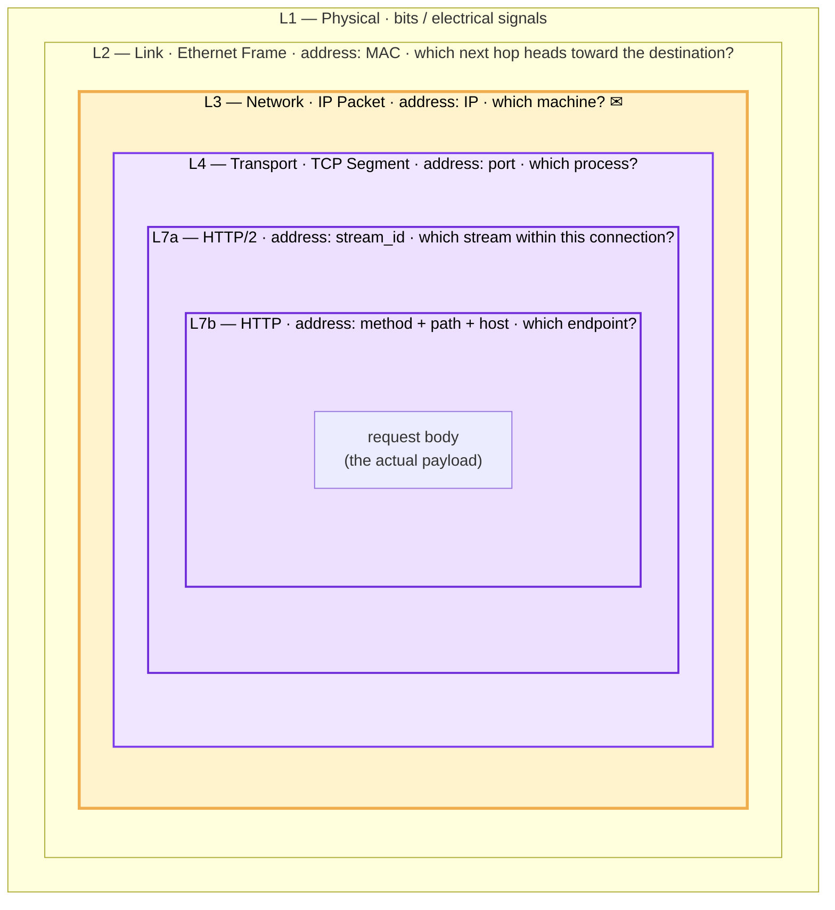
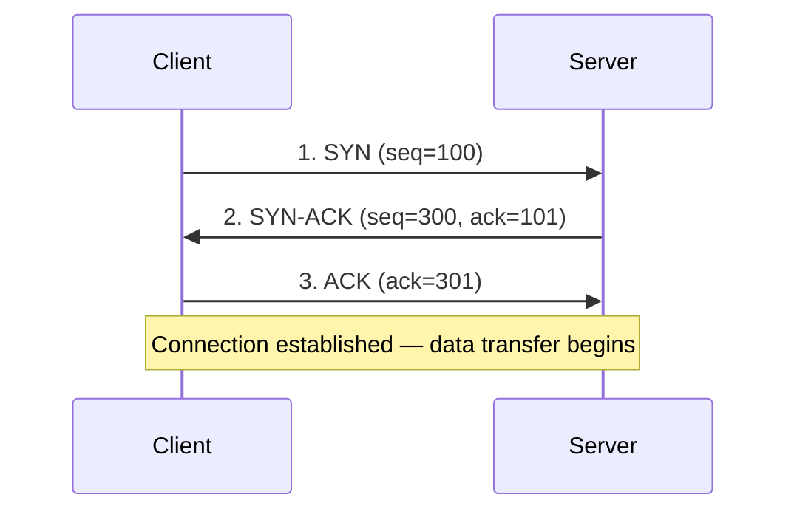
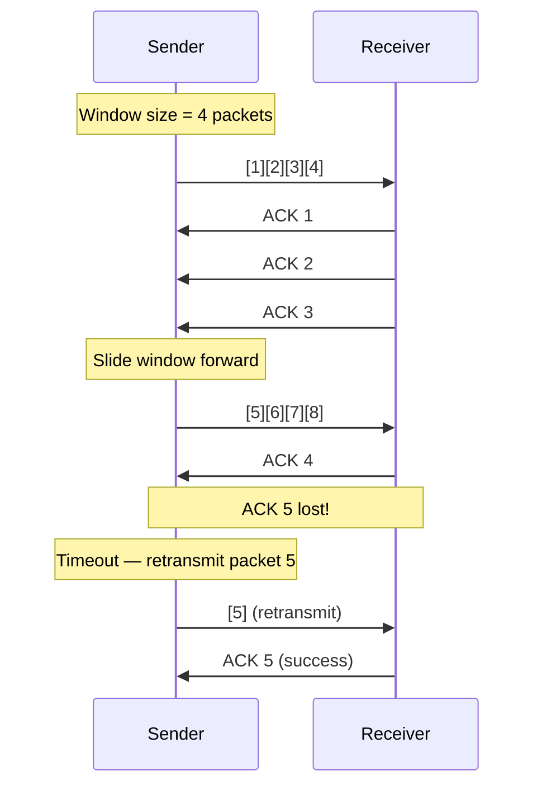
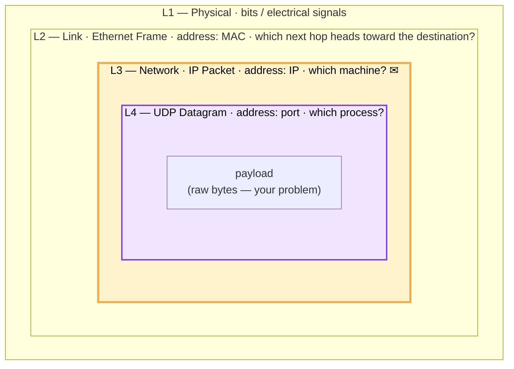
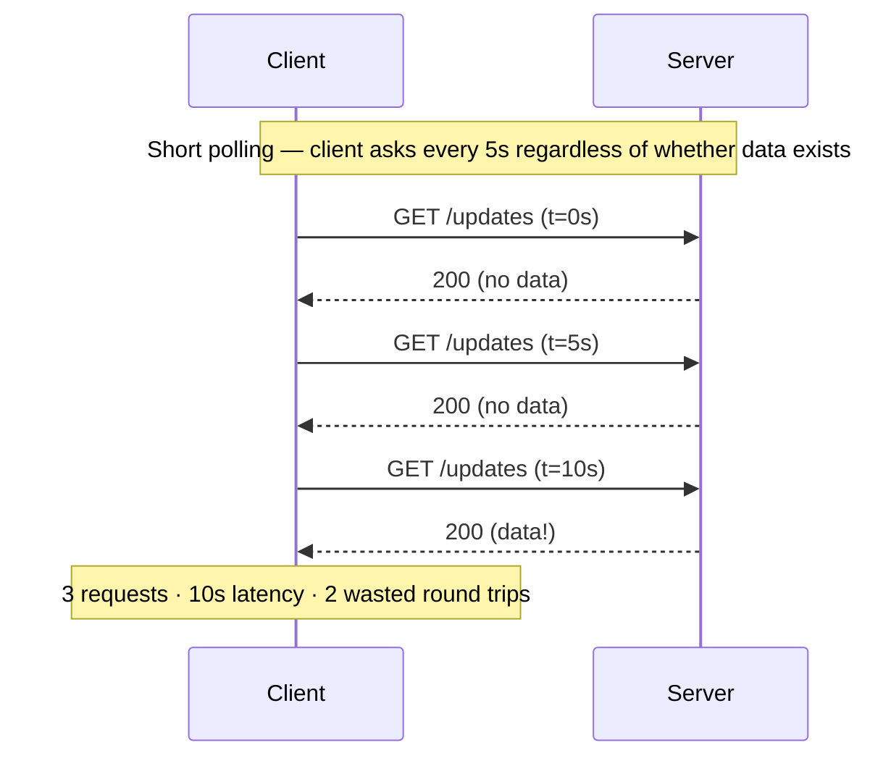
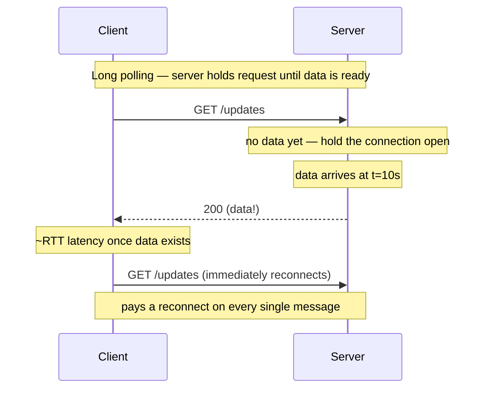
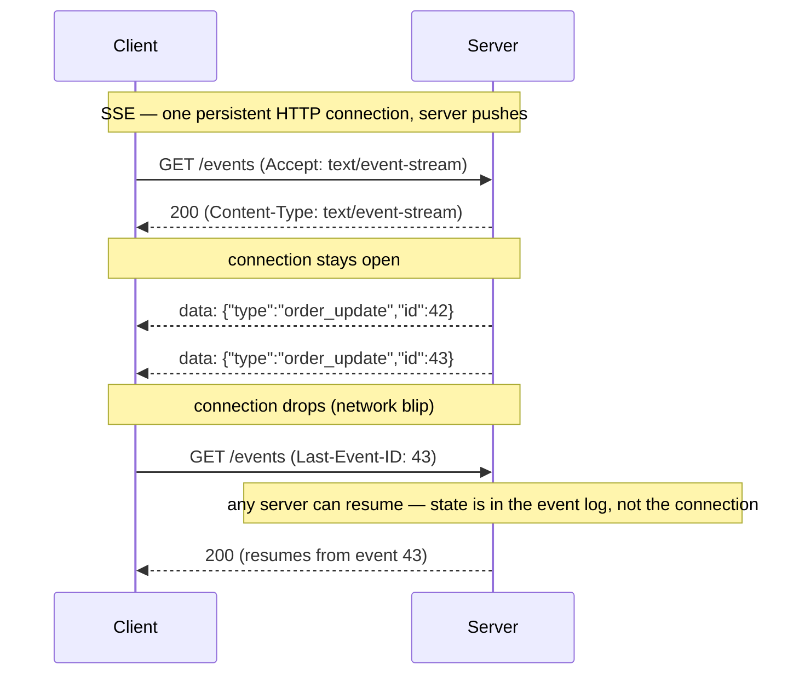
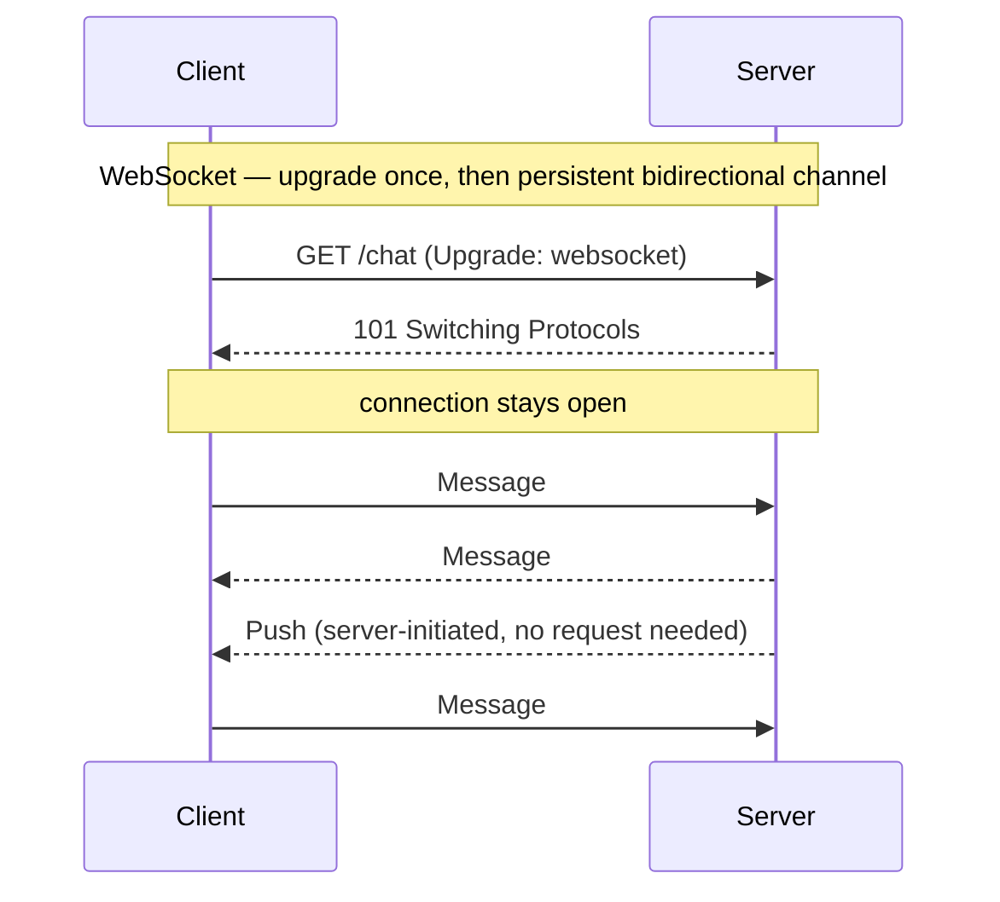
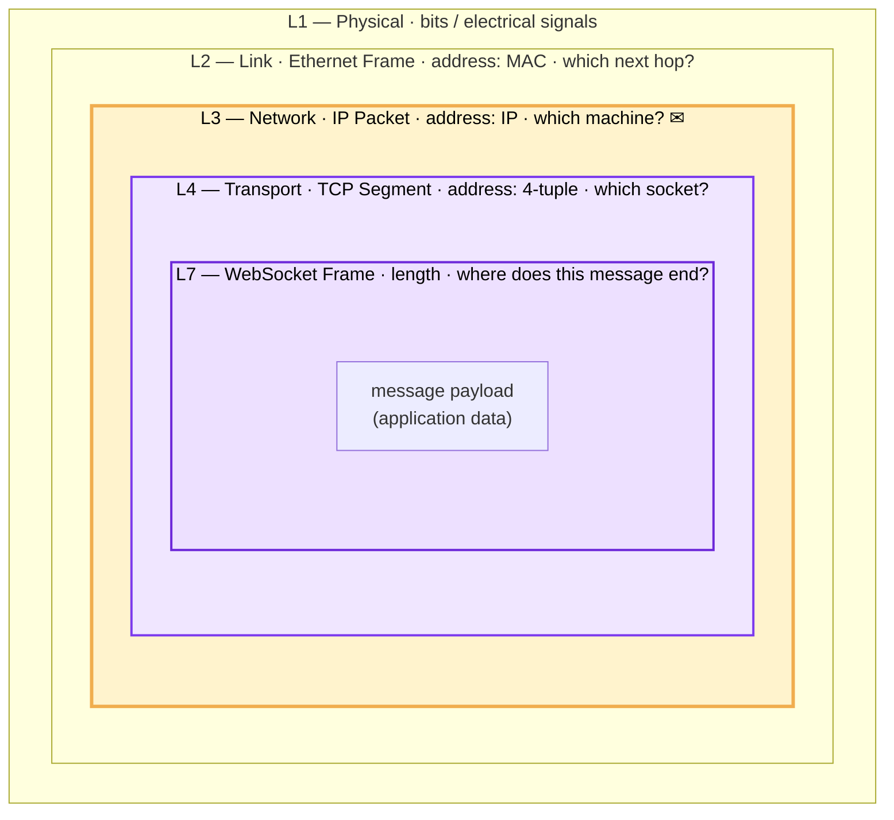

# Networking Fundamentals

> TCP/IP vs UDP, HTTP versions, WebSockets, DNS, and TLS

---

## Learning Objectives

By the end of this topic you will be able to:

- Explain the reliability guarantees TCP provides and the cost at which it provides them, compared to UDP
- Compare HTTP/1.0, HTTP/1.1, HTTP/2, and HTTP/3 and identify which problem each version solves
- Choose between HTTP polling, Server-Sent Events, and WebSockets given a real-time communication requirement
- Explain the DNS resolution chain and how TTL affects both performance and failover speed
- Describe the TLS 1.3 handshake and the strategies used to reduce its latency overhead

---

## ELI5: Explain Like I'm 5

<div class="learner-section" markdown>

**Your task:** After learning networking fundamentals, explain them simply.

**Prompts to guide you:**

1. **What is the difference between TCP and UDP in one sentence?**
    - TCP is a protocol that ___ every packet, while UDP is a protocol that <span class="fill-in">[___ packets without waiting for ___, trading ___ for lower ___]</span>

2. **Why do we need DNS?**
    - DNS exists because <span class="fill-in">[humans remember ___ but computers route traffic using ___, so DNS acts as a ___ that translates between them]</span>

3. **Real-world analogy for TCP vs UDP:**
    - Example: "TCP is like certified mail where..."
    - Think about the difference between sending a registered letter (confirmation of delivery) vs dropping a flyer in a post box (fire and forget).
    - Your analogy: <span class="fill-in">[Fill in]</span>

4. **What does HTTP/2 multiplexing solve?**
    - HTTP/2 multiplexing solves ___ blocking by <span class="fill-in">[allowing ___ requests to travel over a ___ TCP connection simultaneously, so a slow response on stream ___ no longer blocks stream ___]</span>

5. **Real-world analogy for WebSockets:**
    - Example: "WebSockets are like a phone call where..."
    - Think about the difference between sending text messages (each a separate round trip) vs staying on an open phone call.
    - Your analogy: <span class="fill-in">[Fill in]</span>

</div>

---

## Core Concepts

### Topic 1: Networking Layers — The Full Stack

Every piece of data you send travels through a stack of layers, each wrapping the one above it like nested envelopes:

| Layer | Unit | Key concept |
|-------|------|-------------|
| Application (HTTP) — L7b | **Request / Response** | Logical exchange — method, path, headers, body; what the developer writes |
| Application (HTTP/2) — L7a | **Frame** | Wire encoding: HEADERS + DATA frames tagged with a stream_id; stream_id is the multiplexing key |
| Transport (TCP) | **Segment** | Sequence-numbered chunk; TCP retransmits lost segments to guarantee order |
| Transport (UDP) | **Datagram** | Same layer as TCP but no sequencing, no retransmit — fire and forget |
| Network — L3 | **IP Packet** | IP source + destination address; "packet loss" happens here |
| Link — L2 | **Ethernet frame** | MAC addresses; hops between physical devices on the local network |
| Physical — L1 | **Bit / signal** | Electrical or optical signal on the wire |

!!! note "Why 'packet' is used loosely"
    In conversation, "packet" almost always means IP packet — but engineers often use it to mean any of the above units. "Packet loss" = IP packet dropped. "HTTP/2 frame" and "Ethernet frame" both use the word frame but are completely unrelated.

#### TCP / HTTP2

**TCP (Transmission Control Protocol)**

- **Reliable:** Guarantees delivery, ordering, and error checking via sequence numbers and ACKs
- **Connection-oriented:** 3-way handshake required before data transfer begins
- **Flow control:** Sliding window prevents the sender from overwhelming the receiver
- **Congestion control:** Adapts send rate to network conditions
- **Higher overhead:** ACKs, retransmissions, and seq numbers add latency cost
- **Use cases:** HTTP, databases, email, file transfers — anything requiring ordered reliable delivery

TCP sits at L4; HTTP/2 multiplexes many request/response pairs over a single TCP connection using stream IDs:



!!! note "The envelope and the postal driver"
    The **IP packet is the envelope** — it carries the addressed payload across the entire internet. Every router reads the destination address on the outside and stamps the TTL field, but the contents are never touched until the packet reaches its destination.

    The **Ethernet frame is the postal driver** — it only exists for one leg of the journey. Each router strips the incoming frame, reads the IP destination, consults its routing table, and hands the envelope to a new driver (a new Ethernet frame with the next router's MAC as destination). The driver changes at every hop; the envelope does not.

    NAT is the one exception: a NAT device crosses out the return address and rewrites it, maintaining a table so it knows how to forward replies back to the right internal machine.

How `POST /api/users` travels down the stack:

```
[Application code] — the body; what you actually want to send
┌──────────────────────────────────────────────────────────────────────┐
│ Body:  { "name": "alice", "role": "admin" }                           │
└──────────────────────────────────────────────────────────────────────┘
  ↓ HTTP client library wraps body in an HTTP envelope (L7b):
    adds Method, Path, Host, Headers around the body

┈┈┈┈┈┈┈┈┈┈┈┈┈┈┈┈┈┈┈┈┈┈┈┈┈┈┈┈┈┈┈┈┈┈┈┈┈┈┈┈┈┈┈┈┈┈┈┈┈┈┈┈┈┈┈┈┈┈┈┈┈┈┈┈┈┈┈┈┈┈
  ◄ L7 load balancer must unwrap everything below all the way up to here
    L2 → L3 → L4 → decrypt TLS → L7a → only now can it route
    on :path, Host, cookies, or any header value
┈┈┈┈┈┈┈┈┈┈┈┈┈┈┈┈┈┈┈┈┈┈┈┈┈┈┈┈┈┈┈┈┈┈┈┈┈┈┈┈┈┈┈┈┈┈┈┈┈┈┈┈┈┈┈┈┈┈┈┈┈┈┈┈┈┈┈┈┈┈

[L7b — HTTP · which endpoint?]
┌──────────────────────────────────────────────────────────────────────┐
│ Method:   POST                                                        │
│ Path:     /api/users                                                  │
│ Host:     example.com                                                 │
│ Headers:  Content-Type: application/json                              │
├──────────────────────────────────────────────────────────────────────┤
│ Body:     { "name": "alice", "role": "admin" }                        │
└──────────────────────────────────────────────────────────────────────┘
  ↓ HTTP/2 wire-encodes these: headers → HEADERS frame, body → DATA frame

[L7a — HTTP/2 frame · which stream within this connection?]
┌──────────────────────────────────────────────────────────────────────┐
│ Length:   30   (3 bytes)  — HPACK payload size (body is in DATA frame) │
│ Type:    0x1   (1 byte)   — HEADERS frame (0x0=DATA, 0x3=RST_STREAM) │
│ Flags:   0x4   (1 byte)   — END_HEADERS: complete, no continuation   │
│ Stream:    1   (4 bytes)  — request ID; stream_id is the mux key     │
├──────────────────────────────────────────────────────────────────────┤
│ HPACK payload  (~30 bytes)                                            │
│   :method = POST         →  static table entry #3   →   1 byte       │
│   :path = /api/users     →  indexed name, literal value  →  ~12 bytes│
│   :authority = example.com  →  literal name + value  →  ~12 bytes    │
│   content-type = application/json  →  literal          →  ~5 bytes   │
└──────────────────────────────────────────────────────────────────────┘
  followed by a DATA frame carrying the body bytes
  ↓ handed to TCP as raw bytes — TCP does not see frame boundaries
    TLS encrypts this in production; TCP payload is opaque until decrypted
    1 segment may carry multiple frames or a partial frame (TCP cuts at MSS ~1460 bytes)

┈┈┈┈┈┈┈┈┈┈┈┈┈┈┈┈┈┈┈┈┈┈┈┈┈┈┈┈┈┈┈┈┈┈┈┈┈┈┈┈┈┈┈┈┈┈┈┈┈┈┈┈┈┈┈┈┈┈┈┈┈┈┈┈┈┈┈┈┈┈
  ◄ L4 load balancer terminates here
    routes on IP + port only; payload never opened
    no TLS termination required — works with encrypted traffic
┈┈┈┈┈┈┈┈┈┈┈┈┈┈┈┈┈┈┈┈┈┈┈┈┈┈┈┈┈┈┈┈┈┈┈┈┈┈┈┈┈┈┈┈┈┈┈┈┈┈┈┈┈┈┈┈┈┈┈┈┈┈┈┈┈┈┈┈┈┈

[L4 — TCP segment · which process?]
┌──────────────────────────────────────────────────────────────────────┐
│ Src port:   54321  (2 bytes)  — ephemeral port chosen by the OS      │
│ Dst port:     443  (2 bytes)  — HTTPS; OS delivers to the right app  │
│ Seq:         1001  (4 bytes)  — byte offset; receiver reassembles    │
│ Ack:          500  (4 bytes)  — next byte expected from server        │
│ Flags:        ACK  (2 bytes)  — acknowledging received server data    │
│ Window:     65535  (2 bytes)  — how many bytes client can buffer      │
├──────────────────────────────────────────────────────────────────────┤
│ Payload: 34 bytes  ← byte stream slice (not necessarily 1 frame)     │
└──────────────────────────────────────────────────────────────────────┘
  20-byte header + 34-byte payload = 54 bytes

[L3 — IP packet · which machine? ✉ the envelope — end-to-end unchanged]
┌──────────────────────────────────────────────────────────────────────┐
│ Src IP:  192.168.1.5    (4 bytes)  — your machine                    │
│ Dst IP:  93.184.216.34  (4 bytes)  — example.com                     │
│ Proto:   6 (TCP)        (1 byte)   — what's carried inside           │
│ TTL:     64             (1 byte)   — decremented each hop; 0 = drop  │
│ Length:  74             (2 bytes)  — total packet size                │
├──────────────────────────────────────────────────────────────────────┤
│ Payload: 54 bytes  ← TCP segment above                               │
└──────────────────────────────────────────────────────────────────────┘
  20-byte header + 54-byte payload = 74 bytes
  ↓ each router: strips L2, reads dst IP, consults routing table,
    builds new L2 frame for the next hop — L3 packet rides unchanged
    (only TTL and checksum are rewritten per hop)

[L2 — Ethernet frame · which next hop heads toward the destination?]
┌──────────────────────────────────────────────────────────────────────┐
│ Dst MAC:  00:11:22:aa:bb:cc   (6 bytes)  — next hop only, not final  │
│ Src MAC:  aa:bb:cc:11:22:33   (6 bytes)  — your NIC                  │
│ Ethertype: 0x0800             (2 bytes)  — payload is IPv4           │
├──────────────────────────────────────────────────────────────────────┤
│ Payload: 74 bytes  ← IP packet above                                 │
│ FCS: 0xd3f14c2e    (4 bytes)  — checksum; frame dropped if corrupted │
└──────────────────────────────────────────────────────────────────────┘
  14-byte header + 74-byte payload + 4-byte FCS = 92 bytes

[L1 — Physical · signal on the wire]
  01000101 00000000 ...   (92 bytes × 8 = 736 bits transmitted)
```

**TCP 3-Way Handshake:**



**TCP Flow Control (Sliding Window):**



!!! note "Why TCP retransmission hurts real-time applications"
    When a TCP packet is lost, the sender stops advancing the window until that specific packet is acknowledged. This is called head-of-line blocking at the transport layer. For a video stream, waiting 50–200 ms to retransmit a frame that is already stale is worse than simply skipping it — which is exactly what UDP-based protocols do.

#### UDP

**UDP (User Datagram Protocol)**

- **Unreliable:** Best-effort delivery, no guarantees
- **Connectionless:** Send packets without establishing connection
- **No flow/congestion control:** Fast but can lose packets
- **Low overhead:** Minimal protocol overhead
- **Use cases:** Video streaming, gaming, DNS, VoIP

UDP ends at L4. There is no L7 — your application bytes land directly in the datagram payload. The same payload, far fewer layers:



How the same payload travels over UDP:

```
[Application code] — the body; what you actually want to send
┌──────────────────────────────────────────────────────────────────────┐
│ Body:  { "name": "alice", "role": "admin" }                          │
└──────────────────────────────────────────────────────────────────────┘
  ↓ no HTTP envelope, no framing layer — app writes bytes directly to socket

[L7 — Application · what are you sending?]
┌──────────────────────────────────────────────────────────────────────┐
│ { "name": "alice", "role": "admin" }   (37 bytes, raw)               │
└──────────────────────────────────────────────────────────────────────┘
  app owns all framing, ordering, and reliability — or accepts none of it
  ↓ handed to UDP as raw bytes

[L4 — UDP datagram · which process?]
┌──────────────────────────────────────────────────────────────────────┐
│ Src port:  54321  (2 bytes)  — ephemeral port chosen by OS           │
│ Dst port:   9000  (2 bytes)  — target service                        │
│ Length:       45  (2 bytes)  — header + payload                      │
│ Checksum:  0x1a2b (2 bytes)  — optional error detection              │
├──────────────────────────────────────────────────────────────────────┤
│ Payload: 37 bytes  ← raw application bytes, no framing               │
└──────────────────────────────────────────────────────────────────────┘
  8-byte header + 37-byte payload = 45 bytes
  no seq/ack · no retransmit · no connection · no HOL blocking

[L3 — IP packet · which machine? ✉ the envelope — end-to-end unchanged]
┌──────────────────────────────────────────────────────────────────────┐
│ Src IP:  192.168.1.5    (4 bytes)  — your machine                    │
│ Dst IP:  93.184.216.34  (4 bytes)  — example.com                     │
│ Proto:  17 (UDP)        (1 byte)   — what's carried inside           │
│ TTL:     64             (1 byte)   — decremented each hop; 0 = drop  │
│ Length:  65             (2 bytes)  — total packet size               │
├──────────────────────────────────────────────────────────────────────┤
│ Payload: 45 bytes  ← UDP datagram above                              │
└──────────────────────────────────────────────────────────────────────┘
  20-byte header + 45-byte payload = 65 bytes

[L2 — Ethernet frame · which next hop heads toward the destination?]
  (identical to TCP version)

[L1 — Physical · signal on the wire]
  (identical to TCP version)
```

!!! note "What runs over TCP/IP vs UDP/IP"
    **HTTP → TCP/IP**: TCP's reliability and ordering give HTTP its request/response model for free. Every byte arrives in order, so HTTP can parse headers line by line without worrying about gaps or duplicates. The cost is the handshake, ACKs, and HOL blocking.

    **DNS → UDP/IP**: Queries fit in a single datagram (~50 bytes). The DNS client adds a 2-byte query ID to its question; the server echoes it back in the response so the client can match them. No connection needed — if the response doesn't arrive, the client just retries. Fast and cheap for a pure lookup.

    **RTP → UDP/IP**: Audio and video frames have a timestamp and sequence number in the payload. A missed packet is not retransmitted — stale audio from 200ms ago is useless. The receiver uses sequence numbers for jitter buffering and simply conceals the gap. Freshness beats completeness.

    **QUIC → UDP/IP**: HTTP/3's transport layer. Ironically more complex than TCP — it reimplements reliability, ordering, and flow control in userspace, per stream. It runs over UDP specifically to escape the kernel's TCP HOL blocking and to allow faster iteration without OS updates.

#### TCP vs UDP

**Decision Matrix:**

| Requirement | Protocol | Why |
|-------------|----------|-----|
| Must guarantee delivery | TCP | Retransmission on loss |
| Need ordered packets | TCP | Sequence numbers |
| Low latency critical | UDP | No overhead |
| Can tolerate packet loss | UDP | No retransmission delay |
| Real-time streaming | UDP | Prefer fresh data |
| File transfer | TCP | Data integrity critical |
| Live video | UDP | Skip lost frames |
| Database connection | TCP | Reliability required |

**After learning, explain in your own words:**

<div class="learner-section" markdown>

- When would packet loss be acceptable? <span class="fill-in">Use cases like live streaming or gaming where it's better to continue to fetch the latest data rather than waiting for the retransmission due to packet loss</span>
- Why is TCP slower than UDP? <span class="fill-in">TCP requires a handshake SYN/SYN-ACK/ACK just to establish the connection and it waits for per-segment confirmation</span>
- What's the trade-off with reliability? <span class="fill-in">UDP has no reliability, a UDP sender doesn't wait for a SYN-ACK, it just fires and forgets</span>

</div>


!!! note "TCP and HTTP as load balancing layers"
    TCP (Layer 4) and HTTP (Layer 7) are also the two layers at which load balancers operate. A Layer 4 load balancer routes based on IP address and port without reading the payload; a Layer 7 load balancer reads HTTP headers and URLs and can make content-aware routing decisions. The choice between them and when each is appropriate is covered in [09. Load Balancing](09-load-balancing.md).

---


### Topic 2: HTTP Protocol Evolution

**Concept:** HTTP has evolved from simple request-response to sophisticated multiplexed, compressed connections.

**HTTP/1.0 → HTTP/1.1 → HTTP/2 → HTTP/3**

#### HTTP/1.0 (1996) — The Problem

HTTP/1.0 opened a **new TCP connection for every single request** and closed it immediately after the response. Loading a page with 20 assets (HTML + CSS + JS + images) meant 20 separate TCP handshakes, each paying a full round-trip of latency before any data could flow.

```
HTTP/1.0: load a page with 4 assets

TCP handshake → GET /index.html → response → connection closed
TCP handshake → GET /style.css  → response → connection closed
TCP handshake → GET /app.js     → response → connection closed
TCP handshake → GET /image.png  → response → connection closed

4 round-trips of overhead just to establish connections
```

#### HTTP/1.1 (1997) — The Fix

**Features:**

- Persistent connections (keep-alive) — TCP connection stays open and is reused across requests
- Pipelining (send multiple requests without waiting)
- Chunked transfer encoding — server can stream a response before knowing its total size
- Host header (virtual hosting) — one IP address can serve multiple domains

**Problems:**

- Head-of-line blocking (HOL blocking)
- No multiplexing (sequential processing)
- Redundant headers (repeated with each request)
- Limited connections per domain (~6)

**Example of HOL Blocking:**

```
Browser needs: index.html, style.css, app.js, image.png

Connection 1:
  GET /index.html
  [WAIT 200ms]
  ← Response (large HTML file)

  GET /style.css
  [WAIT for index.html to finish!]
  ← Response

  GET /app.js
  [WAIT for style.css!]
  ← Response

Total time: Sequential, each waits for previous
```

#### HTTP/2 (2015)

**The core idea — binary framing and streams:**

HTTP/1.1 is plain text. HTTP/2 splits every message into binary **frames**, each tagged with a **stream ID**. A stream is one logical request/response pair. Because frames carry a stream ID, frames from many streams can be interleaved on the wire and reassembled independently — that's multiplexing.

**Major improvements:**

- **Binary framing layer:** All messages split into frames tagged with stream IDs — enables everything below
- **Multiplexing:** Multiple request/response streams interleaved on one TCP connection — no more 6-connection-per-domain hack
- **HPACK header compression:** First request sends full headers; subsequent requests send only diffs against a shared table — common headers become 1-2 byte indices (~40% bandwidth saving)
- **Stream prioritization:** Client can signal which streams are more critical
- **Server push:** Server proactively sends resources before client asks — *failed in practice; Chrome removed support in 2022, widely misused*

!!! warning "Interview gotcha: HTTP/2 only partially solves HOL blocking"
    HTTP/2 eliminates **application-layer** HOL blocking — you no longer wait for response 1 before sending request 2. But TCP is still a single ordered byte stream underneath. If one TCP packet is lost, TCP buffers everything that arrived after it and delivers nothing to the app — including frames from completely unrelated streams. This **TCP-layer HOL blocking** is what HTTP/3 targets by moving to QUIC over UDP.

**Multiplexing — frames from many streams interleaved on one connection:**

```
HTTP/1.1: up to 6 separate TCP connections (browser limit)

  conn 1 ── GET /index.html ──────────── ← response ──
  conn 2 ── GET /style.css  ──────────── ← response ──
  conn 3 ── GET /app.js     ──────────── ← response ──
  conn 4 ── GET /image.png  ──────────── ← response ──
  ... (need more resources? wait, or open a 5th connection)

HTTP/2: 1 TCP connection — stream_id tags every frame so they can be interleaved

  Stream 1 (index.html): [H:1]──────[D:1]──[D:1]─────────────────────────
  Stream 3 (style.css):       [H:3]─────────────[D:3]────────────────────
  Stream 5 (app.js):          [H:5]──────────────────[D:5]───────────────
  Stream 7 (image.png):            [H:7]──────────────────[D:7]──[D:7]───

  On the wire — one TCP byte stream, all frames mixed together:

  ┌──────┬──────┬──────┬──────┬──────┬──────┬──────┬──────┬──────┐
  │ H:1  │ H:3  │ H:5  │ D:1  │ H:7  │ D:1  │ D:3  │ D:5  │ D:7  │ ...
  └──────┴──────┴──────┴──────┴──────┴──────┴──────┴──────┴──────┘
  ├──────────── TCP Segment 1 (≤1460 bytes) ───────────────────────┤├─ Seg 2

  Receiver sees each frame's stream_id and routes it to the right buffer.
  TCP cuts at byte count — one segment may span parts of multiple frames.
  If Segment 1 is lost, every stream stalls: TCP-layer HOL blocking.
```

#### HTTP/3 (2020)

**Built on QUIC (UDP-based):**

- **No HOL blocking at transport layer:** HTTP/2 still suffered from TCP HOL blocking
- **Faster connection establishment:** 0-RTT handshake
- **Better mobile performance:** Connection migration (IP change resilience)
- **Improved congestion control:** Per-stream instead of per-connection

**HTTP/2 vs HTTP/3 — what changes with QUIC:**

HTTP/2 multiplexes streams at the application layer but they all share one TCP byte stream. A single lost TCP packet stalls every stream — streams 1, 3, 4 wait even though their data arrived, because TCP won't hand anything out of order to the app.

HTTP/3 implements streams at the transport layer inside QUIC. A lost packet for stream 2 only stalls stream 2. Streams 1, 3, 4 keep flowing independently.

```
HTTP/2 + TCP — one lost segment blocks every stream

  ┌──────┬──────┬──────┬──────┬──────┬──────┐
  │ H:1  │ D:1  │ H:3  │ D:3  │ H:5  │ D:5  │ ...
  └──────┴──────┴──────┴──────┴──────┴──────┘
  ├────── TCP Seg 1 (received ✓) ──────────────┤✗ Seg 2 lost  ├── Seg 3 ✓

  Seg 3 data sits in the kernel receive buffer, undeliverable:
    Stream 1 ⟳   Stream 3 ⟳   Stream 5 ⟳   — all stalled waiting for Seg 2


HTTP/3 + QUIC — loss is isolated to the stream(s) in the dropped packet

  ┌─────────────────────┐  ┌─────────────────────┐  ┌─────────────────────┐
  │   H:1       D:1     │  │   H:3       D:3     │  │   H:5       D:5     │
  │   QUIC pkt 1 ✓      │  │   QUIC pkt 2 ✗      │  │   QUIC pkt 3 ✓      │
  └─────────────────────┘  └─────────────────────┘  └─────────────────────┘

  QUIC delivers pkts 1 and 3 immediately:
    Stream 1 ✓   Stream 3 ⟳ (only this stream waits)   Stream 5 ✓

  Loss detection: receiver ACKs pkts 1 and 3 but not pkt 2; after a threshold
  of subsequent ACKs, sender declares pkt 2 lost and retransmits stream 3's
  data in a new QUIC packet — streams 1 and 5 were never interrupted.
```

**Performance Comparison:**

| Metric | HTTP/1.1 | HTTP/2 | HTTP/3 |
|--------|----------|--------|--------|
| Connections per domain | 6 | 1 | 1 |
| Multiplexing | No | Yes | Yes |
| Header compression | No | Yes (HPACK) | Yes (QPACK) |
| HOL blocking | Yes | Partial (TCP) | No |
| Connection setup | 1-2 RTT | 1-2 RTT | 0-1 RTT |
| Mobile resilience | Poor | Poor | Excellent |

!!! note "The ordering constraint — one pattern, every layer of the stack"
    TCP's in-order delivery guarantee creates **head-of-line blocking**: when a segment is lost, TCP withholds all subsequent bytes from HTTP/2 until the gap is filled by retransmit. HTTP/2's per-stream buffers never even see the bytes sitting in later segments — the block happens below them, at the TCP layer.

    HTTP/3 moves to QUIC over UDP and reimplements reliability *per stream* in userspace. QUIC uses two separate numbering systems: **QUIC packet numbers** (monotonically increasing, connection-wide) for loss detection — when the receiver ACKs packets 1 and 3 but not 2, the sender declares packet 2 lost and retransmits its stream data in a new packet; and **stream offsets** (per-stream byte counters, like TCP sequence numbers but scoped to one stream) for in-order delivery within that stream. The decoupling is the key: loss detection is connection-wide, but the delivery stall is stream-local. A lost packet only blocks the streams whose data it carried; all other streams keep flowing.

    This is the same architectural tension that appears across computer science wherever ordering is guaranteed over a shared channel:

    - **Kafka partitions** — ordering is guaranteed within a partition; a stalled consumer blocks that partition. The fix is more partitions — more independent ordered streams. Exactly QUIC's solution, 20 years earlier at a different layer.
    - **CPU out-of-order execution** — instructions execute out of order internally, but the reorder buffer commits results in-order. A stalled instruction at the head blocks commit of everything behind it.
    - **Database WAL recovery** — log entries must be applied in sequence; a gap stalls replay.

    The pattern: **a single ordered channel is simple to reason about but creates a bottleneck at gaps. The fix is always the same — push the ordering constraint up a level so gaps in one lane don't block others.**

---

### Topic 3: Real-Time Communication

Four models for getting data from server to client in real-time. Each one solves the previous model's biggest problem.

#### Short polling

Client asks on a fixed timer. Server is fully stateless — any server can handle any request.



**Problem it leaves unsolved:** latency is bounded by the poll interval, and most requests are wasted.

!!! note "Real-world use"
    GitHub Actions CI status page, cron-driven dashboard widgets, any admin panel that shows "last synced" data. Simple enough that many teams reach for it first and never need to change it.

#### Long polling

Client sends a request; server holds it open until data is available, then responds and closes. Client immediately reconnects.



**Problem it leaves unsolved:** reconnect overhead on every message; awkward to implement correctly; still stateless but the held connection consumes a server thread/slot.

!!! note "Real-world use"
    Facebook Chat used long polling before switching to MQTT/WebSockets. Intercom's in-app messenger originally used it. Still common in legacy enterprise apps where WebSockets are blocked by corporate firewalls, and in environments where you can't upgrade the server.

#### Server-Sent Events (SSE)

Server pushes over a single persistent HTTP connection. The browser `EventSource` API handles reconnection automatically, sending `Last-Event-ID` so any server can resume the stream.



**Problem it leaves unsolved:** unidirectional — server→client only. If the client also needs to stream data to the server, SSE can't help.

!!! note "Real-world use"
    GitHub's live feed of repository events, Vercel/Netlify deployment log streaming, OpenAI's ChatGPT streaming responses (tokens arrive token-by-token via SSE), Cloudflare's analytics dashboard. Essentially anything that looks like a live log tail or a progress stream.

**Spring SseEmitter (minimal):**

```java
// one emitter per connected client
// default fd limit ~1024 (ulimit -n); tune to millions via /etc/security/limits.conf
// at that scale memory is the constraint: ~174 KB kernel buffers/connection → 1M connections ≈ 200 GB
@RestController
public class OrderController {
    private final List<SseEmitter> emitters = new CopyOnWriteArrayList<>();

    @GetMapping(value = "/events", produces = MediaType.TEXT_EVENT_STREAM_VALUE)
    public SseEmitter subscribe() {
        var e = new SseEmitter(Long.MAX_VALUE);
        emitters.add(e);
        e.onCompletion(() -> emitters.remove(e));
        return e;
    }

    public void broadcast(Object data) { // call this to push an event to all clients
        var it = emitters.iterator();
        while (it.hasNext()) {
            try { it.next().send(data); }
            catch (IOException e) { it.remove(); } // disconnected — remove
        }
    }
}
```

#### WebSockets

Bidirectional, persistent. The connection is established via an HTTP upgrade and then the HTTP layer disappears — all subsequent messages are WebSocket frames.

**WebSocket (persistent bidirectional channel):**



**How a WebSocket message travels down the stack:**

Compare to the TCP/HTTP2 stack — L7 collapses to a single delimiting layer (no routing, no operation semantics), and the TCP segment needs no routing lookup because the connection is already established:



```
[Application code] — the message to send
┌──────────────────────────────────────────────────────────────────────┐
│ { "room": "general", "text": "hello" }                               │
└──────────────────────────────────────────────────────────────────────┘
  ↓ WebSocket library wraps in a frame (L7):
    no Host, no path, no method — routing was settled at upgrade time

[L7 — WebSocket Frame · where does this message end?]
┌──────────────────────────────────────────────────────────────────────┐
│ FIN:    1      (1 bit)  — complete message, no fragmentation         │
│ Opcode: 0x1    (4 bits) — text frame (0x2=binary, 0x8=close)         │
│ Mask:   1      (1 bit)  — client→server must mask                    │
│ Length: 38     (7 bits) — payload size                               │
├──────────────────────────────────────────────────────────────────────┤
│ Masking key: 0x4a3f2e1d  (4 bytes)                                   │
├──────────────────────────────────────────────────────────────────────┤
│ Payload: { "room": "general", "text": "hello" }  (38 bytes, masked)  │
└──────────────────────────────────────────────────────────────────────┘
  ↓ handed to the existing TCP connection — no new handshake

[L4 — TCP Segment · which socket?]
┌──────────────────────────────────────────────────────────────────────┐
│ Src port:   54321  (2 bytes)  ┐                                      │
│ Dst port:     443  (2 bytes)  ├─ 4-tuple → socket fd47 (established  │
│                               │  at upgrade) — OS routes immediately │
│ Seq:         1839  (4 bytes)  — byte offset continues from handshake │
│ Ack:          912  (4 bytes)  — acknowledging server data            │
│ Window:     65535  (2 bytes)                                         │
├──────────────────────────────────────────────────────────────────────┤
│ Payload: 44 bytes  ← WebSocket frame above                           │
└──────────────────────────────────────────────────────────────────────┘
  same connection as the HTTP upgrade — Seq continues from where it left off

[L3 — IP packet · which machine? ✉ the envelope — end-to-end unchanged]
┌──────────────────────────────────────────────────────────────────────┐
│ Src IP:  192.168.1.5    (4 bytes)  — your machine                    │
│ Dst IP:  93.184.216.34  (4 bytes)  — example.com                     │
│ Proto:   6 (TCP)        (1 byte)   — what's carried inside           │
│ TTL:     64             (1 byte)   — decremented each hop; 0 = drop  │
│ Length:  84             (2 bytes)  — total packet size               │
├──────────────────────────────────────────────────────────────────────┤
│ Payload: 64 bytes  ← TCP segment above                               │
└──────────────────────────────────────────────────────────────────────┘
  20-byte header + 64-byte payload = 84 bytes

[L2 → L1 — identical to the TCP/HTTP2 stack]
```

**WebSocket Handshake:**

```http
Client → Server:
GET /chat HTTP/1.1
Host: example.com
Upgrade: websocket
Connection: Upgrade
Sec-WebSocket-Key: dGhlIHNhbXBsZSBub25jZQ==
Sec-WebSocket-Version: 13

Server → Client:
HTTP/1.1 101 Switching Protocols
Upgrade: websocket
Connection: Upgrade
Sec-WebSocket-Accept: s3pPLMBiTxaQ9kYGzzhZRbK+xOo=

[Connection now upgraded to WebSocket]
```

**What a WebSocket server holds per connection:**

```
OS kernel (per connection):
  - socket file descriptor (counts against ulimit -n; default 1024, tunable to millions)
  - TCP send buffer:    ~87 KB   (holds unacknowledged outbound bytes)
  - TCP receive buffer: ~87 KB   (holds inbound bytes not yet read by app)
  Total kernel overhead: ~174 KB per connection

Application (your code, per connection):
  - socket handle / fd reference
  - auth context:       userId, roles, session token  (set at upgrade time)
  - subscription state: which rooms/topics/channels   (updated by messages)
  - any app state:      cursor position, game state, etc.

At 10,000 connections:
  kernel buffers alone: ~1.7 GB
  + application state per connection
```

The deeper scaling problem: the connection is **pinned to one server process**. Unlike HTTP where any server can handle any request, a WebSocket message arriving for user Alice must reach the server that holds Alice's socket. This forces one of two designs:

```
Option 1 — sticky sessions
  Load balancer routes Alice's requests to Server 1 always.
  Simple, but Server 1 becomes a hotspot and failover loses connections.

Option 2 — pub/sub fan-out
  Any server accepts any message. Server publishes to Redis.
  Redis fans out to whichever server holds the target socket.

  Client ──→ Server 2 ──→ Redis pub/sub ──→ Server 1 ──→ Alice's socket
                                         ──→ Server 3 ──→ Bob's socket
```

SSE avoids this entirely — a reconnect carries `Last-Event-ID` and any server can resume from an event log.

!!! note "Real-world use"
    Slack (real-time messaging and presence), Figma (multiplayer collaborative editing — cursor positions and drawing ops), Google Docs (collaborative editing), Discord (voice + text channels), Binance/Coinbase (live order book updates where users also submit trades). The bidirectionality is the key signal — users are continuously sending, not just receiving.

**Spring WebSocketHandler (minimal):**

```java
// one session per connected client — same fd and memory constraints as SSE (~174 KB kernel buffers)
// additionally: connections are pinned to one server → sticky sessions or Redis pub/sub for horizontal scaling
@Component
public class ChatHandler extends TextWebSocketHandler {
    private final Map<String, WebSocketSession> sessions = new ConcurrentHashMap<>();

    @Override
    public void afterConnectionEstablished(WebSocketSession s) {
        String userId = (String) s.getAttributes().get("userId"); // populated at handshake
        sessions.put(userId, s);
    }

    @Override
    public void afterConnectionClosed(WebSocketSession s, CloseStatus status) {
        sessions.remove((String) s.getAttributes().get("userId"));
    }

    @Override
    protected void handleTextMessage(WebSocketSession session, TextMessage msg) throws Exception {
        // parse msg to find target, then:
        sendTo(targetUserId, new TextMessage("hello"));
    }

    public void sendTo(String userId, TextMessage msg) throws IOException {
        WebSocketSession s = sessions.get(userId);
        if (s != null && s.isOpen()) s.sendMessage(msg);
    }
}
```

#### Which to use

Three questions, in order:

**1. Can the client tolerate N seconds of latency and are updates infrequent?**
Use short polling. It's stateless, trivially scalable, and operationally boring. Don't over-engineer a cron-job dashboard into a WebSocket server.

**2. Is data flow server→client only?**
Use SSE. Notifications, live feeds, order tracking, dashboards — almost all "real-time" UIs only need server push. SSE gives you ~RTT latency, automatic reconnect, and stateless horizontal scaling for free. No pub/sub layer, no sticky sessions.

**3. Does the client also stream data continuously to the server?**
Use WebSockets. Chat (users send messages), collaborative editing (cursor positions, operations), multiplayer games (player input every tick). The bidirectional requirement is the signal — not "it feels real-time."

!!! danger "Reaching for WebSockets by default"
    The most common mistake is treating WebSockets as the default for anything "real-time." A live notification badge, a stock ticker, a progress bar — none of these need bidirectional streaming. Using WebSockets for server-push-only features adds sticky session complexity or a Redis pub/sub layer for no benefit. SSE is the right tool and is routinely overlooked.

---

## Before/After: Why Networking Fundamentals Matter

**Your task:** Compare naive networking assumptions vs proper understanding to see the impact.

### Example: HTTP Connection Management

**Problem:** Mobile app making 100 API requests to load user dashboard

#### Approach 1: Naive HTTP/1.1 (Sequential Requests)

```
Client needs to load dashboard with:

- User profile (1 request)
- 20 recent posts (20 requests)
- 50 friend suggestions (50 requests)
- 10 notifications (10 requests)
- Analytics data (19 requests)

Total: 100 requests

HTTP/1.1 behavior:

- Opens connection
- Request 1 → Response 1
- Request 2 → Response 2
- ...
- Request 100 → Response 100
- Closes connection

Time analysis:

- Each request: ~50ms (network RTT) + processing
- Sequential: 100 * 50ms = 5,000ms = 5 seconds!
- User sees: Loading spinner for 5 seconds
```

**Problems:**

- Head-of-line blocking (each request waits for previous)
- Connection overhead repeated
- Poor mobile experience
- Inefficient bandwidth usage

#### Approach 2: HTTP/2 Multiplexing

```
HTTP/2 behavior:

- Opens single connection
- Sends all 100 requests simultaneously (multiplexed)
- Server streams responses back as ready
- Uses single TCP connection efficiently

Time analysis:

- All requests sent: ~50ms (single RTT)
- Server processing: ~200ms (parallel)
- Total: ~250ms vs 5,000ms
- 20x faster!

Additional benefits:

- Header compression (HPACK)
- Server push (preload resources)
- Stream prioritization
```

**Real-world impact:**

- HTTP/1.1: 5 second load time → user abandonment
- HTTP/2: 250ms load time → seamless experience
- Mobile data savings: ~40% from header compression

**Your calculation:** For 50 concurrent requests:

- HTTP/1.1 time: <span class="fill-in">_____</span> ms
- HTTP/2 time: <span class="fill-in">_____</span> ms
- Speedup factor: <span class="fill-in">_____</span>x

---

## Case Studies: Networking in the Wild

### Online Gaming (Fortnite, Call of Duty): UDP for Speed

- **Pattern:** UDP for real-time game data.
- **How it works:** Player movements, actions, and shots are sent via UDP packets. If a packet is lost (e.g., showing a
  player's position from 50ms ago), the game doesn't wait. It simply discards the old data and uses the next available
  packet. Waiting for a TCP retransmission would cause noticeable lag (rubber-banding).
- **Key Takeaway:** For applications where the most recent data is more important than guaranteed delivery of every
  single piece of data, UDP is the superior choice. The trade-off is that the application layer must handle potential
  packet loss.

### Google & YouTube: HTTP/2 and HTTP/3 (QUIC) Adoption

- **Pattern:** Modern HTTP protocols for web performance.
- **How it works:** Google was a pioneer of both SPDY (the precursor to HTTP/2) and QUIC (the transport protocol for
  HTTP/3). On sites like YouTube, QUIC significantly reduces connection and stream setup time. This is especially
  noticeable on mobile networks, where it can seamlessly migrate a user's connection from Wi-Fi to cellular data without
  interrupting the video stream, a major weakness of TCP.
- **Key Takeaway:** Adopting modern protocols like HTTP/2 and HTTP/3 is critical for performance at scale. The move from
  TCP to a UDP-based protocol (QUIC) in HTTP/3 solves fundamental transport-layer problems like Head-of-Line blocking.

### Slack & Discord: WebSockets for Real-Time Chat

- **Pattern:** WebSockets for persistent, bidirectional communication.
- **How it works:** When you open Slack or Discord, your client establishes a single, long-lived WebSocket connection to
  their servers. When a new message is sent in a channel, the server pushes that message immediately to all connected
  clients in that channel.
- **Key Takeaway:** Compared to old-school HTTP polling, WebSockets reduce latency from seconds to milliseconds and
  drastically decrease unnecessary network traffic and server load, making them essential for any real-time interactive
  application.

### Netflix: DNS for Global Load Balancing

- **Pattern:** DNS-based Global Server Load Balancing (GSLB).
- **How it works:** When you press play on Netflix, your device makes a DNS request for the server hosting the video
  content. Netflix's DNS servers don't just return a single IP address; they return the IP address of the Open Connect
  Appliance (OCA) cache server that is geographically and topologically closest to you.
- **Key Takeaway:** DNS is not just for finding IPs. It's a powerful tool for global traffic routing. By directing users
  to the nearest server at the DNS level, Netflix ensures low latency, high-quality streaming and distributes load
  across its global content delivery network.

---

## Common Misconceptions

!!! danger "HTTPS is significantly slower than HTTP"
    TLS 1.3 adds only one additional round trip on the initial connection, and session resumption can reduce that to zero extra round trips (0-RTT). With connection pooling and keep-alive, the TLS handshake cost is amortised across hundreds of requests. The CPU overhead for modern AES-GCM encryption is under 5% on current hardware. The performance gap between HTTP and HTTPS is negligible in practice.

!!! danger "HTTP/2 eliminates all head-of-line blocking"
    HTTP/2 eliminates *application-layer* HOL blocking (multiple streams on one connection). However, because it runs over a single TCP connection, a lost TCP packet still blocks *all* HTTP/2 streams until the packet is retransmitted — this is *transport-layer* HOL blocking. HTTP/3 (QUIC) solves this by running streams independently over UDP.

!!! danger "DNS round-robin is sufficient for load balancing"
    DNS round-robin cycles IP addresses but has no health checks — it will happily return the IP of a crashed server. It also cannot respond to actual server load; an overloaded server receives the same share as an idle one. And client-side DNS caching means the "rotation" is unpredictable in practice. DNS round-robin is a last resort, not a real load balancing strategy.

---

## Decision Framework: Choosing an API Communication Protocol

<div class="learner-section" markdown>

**Your task:** Fill in the matrix based on the material above.

### Trade-off Analysis Matrix

| Protocol | Communication model | Latency | Browser support | Streaming | Key failure mode |
|---|---|---|---|---|---|
| **REST / HTTP** | <span class="fill-in">[Fill in]</span> | <span class="fill-in">[Fill in]</span> | <span class="fill-in">[Fill in]</span> | <span class="fill-in">[Fill in]</span> | <span class="fill-in">[Fill in]</span> |
| **gRPC** | <span class="fill-in">[Fill in]</span> | <span class="fill-in">[Fill in]</span> | <span class="fill-in">[Fill in]</span> | <span class="fill-in">[Fill in]</span> | <span class="fill-in">[Fill in]</span> |
| **WebSocket** | <span class="fill-in">[Fill in]</span> | <span class="fill-in">[Fill in]</span> | <span class="fill-in">[Fill in]</span> | <span class="fill-in">[Fill in]</span> | <span class="fill-in">[Fill in]</span> |
| **Server-Sent Events (SSE)** | <span class="fill-in">[Fill in]</span> | <span class="fill-in">[Fill in]</span> | <span class="fill-in">[Fill in]</span> | <span class="fill-in">[Fill in]</span> | <span class="fill-in">[Fill in]</span> |

??? success "Answers"

    | Protocol | Communication model | Latency | Browser support | Streaming | Key failure mode |
    |---|---|---|---|---|---|
    | **REST / HTTP** | Request-response, client-initiated | ~1ms overhead per request | Universal | No native — polling required | Deep cursor/offset pagination; no built-in server push |
    | **gRPC** | Request-response or bidirectional streaming over HTTP/2 | Low — binary Protobuf, HTTP/2 multiplexing eliminates head-of-line blocking | Limited — requires gRPC-Web proxy for browsers | Yes — unary, server, client, and bidirectional streaming | Proto schema evolution: renaming a field or reusing a field number breaks deserialization; .proto files are the shared contract |
    | **WebSocket** | Bidirectional full-duplex over persistent TCP connection | Near-zero once connected | Universal (RFC 6455) | Yes — both directions | Server must manage reconnect, heartbeat, and state per connection; connection count bounded by OS file descriptors |
    | **Server-Sent Events (SSE)** | Server-push, one-directional over persistent HTTP | Low — persistent HTTP connection | Universal (native browser EventSource) | Yes — server to client only | No client-to-server streaming; automatic reconnection may miss events without event ID tracking |

</div>

!!! warning "When it breaks"
    TCP breaks for latency-sensitive applications when a single lost packet stalls all streams — the retransmission timeout (RTO) floor is typically 200ms, meaning a 0.1% loss rate can spike p99 latency by 200ms. HTTP/1.1 breaks at more than 6 concurrent requests per domain (the browser connection limit), which is why HTTP/2 multiplexing matters for page load time. DNS breaks during deployments when TTL is too low (amplified query volume) or too high (stale records persist for hours after failover). TLS 1.3 reduced the handshake to 1 round trip, but the full handshake still costs ~100ms on intercontinental connections — session resumption is not optional at scale.


---

## Practice Scenarios

<div class="learner-section" markdown>

### Scenario 1: E-Commerce Platform

**Requirements:**

- Product catalog browsing
- Real-time inventory updates
- Checkout process
- 10K concurrent users
- Global user base

**Your design:**

Protocol choices:

- Catalog API: <span class="fill-in">[HTTP/2 or HTTP/3? Why?]</span>
- Inventory updates: <span class="fill-in">[WebSocket/SSE/Polling?]</span>
- Checkout: <span class="fill-in">[HTTPS with what considerations?]</span>

DNS strategy:

- TTL: <span class="fill-in">[How long?]</span>
- Multi-region: <span class="fill-in">[GeoDNS?]</span>

**Failure modes:**

- What happens if the WebSocket server handling real-time inventory updates crashes while 10K users are connected during a flash sale? <span class="fill-in">[Fill in]</span>
- How does your design behave when GeoDNS misconfiguration routes all global users to a single region, overloading that data centre? <span class="fill-in">[Fill in]</span>

### Scenario 2: Multiplayer Game

**Requirements:**

- 60 tick rate (updates per second)
- < 50ms latency requirement
- 100 players per game
- Unreliable networks (mobile)

**Your design:**

Protocol: <span class="fill-in">[TCP or UDP? Why?]</span>

Packet loss handling:

- Strategy: <span class="fill-in">[How to handle?]</span>
- Acceptable loss rate: <span class="fill-in">[X%?]</span>

Latency optimization:

- Connection pooling: <span class="fill-in">[Helpful?]</span>
- Regional servers: <span class="fill-in">[Required?]</span>

**Failure modes:**

- What happens if a regional game server becomes unavailable mid-match for 20 of the 100 players due to a network partition? <span class="fill-in">[Fill in]</span>
- How does your design behave when mobile network jitter pushes packet loss above your acceptable rate and the UDP-based game state diverges between clients? <span class="fill-in">[Fill in]</span>

### Scenario 3: Video Conferencing

**Requirements:**

- Real-time audio/video
- Screen sharing
- Chat messaging
- Recording capability

**Your design:**

Media protocols:

- Audio/Video: <span class="fill-in">[UDP/TCP/WebRTC?]</span>
- Chat: <span class="fill-in">[WebSocket/HTTP?]</span>
- Recording: <span class="fill-in">[How to implement?]</span>

Quality vs Latency:

- Packet loss: <span class="fill-in">[How to handle?]</span>
- Bandwidth adaptation: <span class="fill-in">[Strategy?]</span>

**Failure modes:**

- What happens if the TURN relay server (used for NAT traversal) becomes unavailable for participants behind strict firewalls? <span class="fill-in">[Fill in]</span>
- How does your design behave when a participant's available bandwidth drops sharply mid-call and the system cannot adapt quickly enough to prevent audio/video freeze? <span class="fill-in">[Fill in]</span>

</div>

---

## Test Your Understanding

Answer these without referring to your notes or implementation.

1. A TCP packet is lost mid-stream on an HTTP/2 connection carrying four multiplexed streams. Describe precisely what happens to each of the four streams and explain why HTTP/3 behaves differently.

    ??? success "Rubric"
        A complete answer addresses: (1) when TCP detects the lost packet, it halts delivery of all data in the receive buffer to the application — all four HTTP/2 streams stall even if their data arrived intact, because TCP guarantees in-order delivery, (2) this is transport-layer head-of-line blocking, distinct from the application-layer HOL blocking that HTTP/2 already solved, and (3) HTTP/3 over QUIC handles each stream independently at the transport layer so a lost packet for stream 2 only blocks stream 2; streams 1, 3, and 4 continue uninterrupted.

2. You need to reduce the time it takes to fail over a service to a new IP address from 1 hour to under 2 minutes. What change do you make and when must you make it relative to the failover event?

    ??? success "Rubric"
        A complete answer addresses: (1) the 1-hour delay is caused by a DNS TTL of 3600 seconds — cached resolvers and clients will not query for a new IP until the TTL expires, (2) the fix is to lower the TTL (e.g., to 60 seconds) *before* the planned failover — ideally hours or days in advance, so old caches expire the long TTL before it matters, and (3) lowering TTL after the incident has already started does not help because caches are already holding the old value for up to the original TTL duration.

3. A chat application currently polls the server every 2 seconds. At 50,000 concurrent users, calculate the approximate number of HTTP requests per minute this generates, then explain what switching to WebSockets changes.

    ??? success "Rubric"
        A complete answer addresses: (1) 50,000 users × 30 polls/minute = 1,500,000 HTTP requests per minute, regardless of whether there are any new messages, (2) switching to WebSockets replaces this constant polling load with a persistent connection per user — the server only pushes data when a message actually exists, reducing request volume to approximately the actual message rate, and (3) WebSockets also eliminate the per-request HTTP overhead (headers, connection setup) and reduce server CPU and bandwidth proportionally.

4. A colleague says "We use TLS everywhere so our API is secure." What important security concern does TLS *not* address?

    ??? success "Rubric"
        A complete answer addresses: (1) TLS protects data *in transit* — it prevents eavesdropping and tampering on the network — but does nothing about data at rest, (2) TLS does not provide authentication or authorisation of the caller: it proves the server's identity via its certificate but does not verify that the authenticated server-side principal is *authorised* to perform the requested operation, and (3) TLS does not protect against application-layer vulnerabilities such as SQL injection, broken access control, or a compromised client sending valid but malicious requests.

---

## Review Checklist

<div class="learner-section" markdown>

Complete this checklist after implementing and studying all networking topics.

- [ ] Can explain TCP vs UDP trade-offs and cite concrete use cases for each
- [ ] Can describe HTTP/1.1 → HTTP/2 → HTTP/3 improvements and when each is preferred
- [ ] Can explain how WebSockets differ from HTTP polling and describe the upgrade handshake
- [ ] Can trace a DNS resolution from browser to IP address, including recursive vs iterative queries
- [ ] Can describe the TLS handshake steps and explain the performance cost

</div>

---

## Connected Topics

<div class="bs-callout bs-callout-info" markdown>

**Where this topic connects**

- **06. API Design** — HTTP/1.1, HTTP/2, and HTTP/3 directly shape API design choices for latency, multiplexing, and connection management → [06. API Design](06-api-design.md)
- **07. Security Patterns** — TLS (covered here) is the transport layer that makes token-based authentication safe; without it, JWTs and API keys are exposed in transit → [07. Security Patterns](07-security-patterns.md)
- **09. Load Balancing** — TCP (Layer 4) and HTTP (Layer 7) are the two layers at which load balancers operate; the protocol coverage here provides context for that routing decision → [09. Load Balancing](09-load-balancing.md)

</div>
